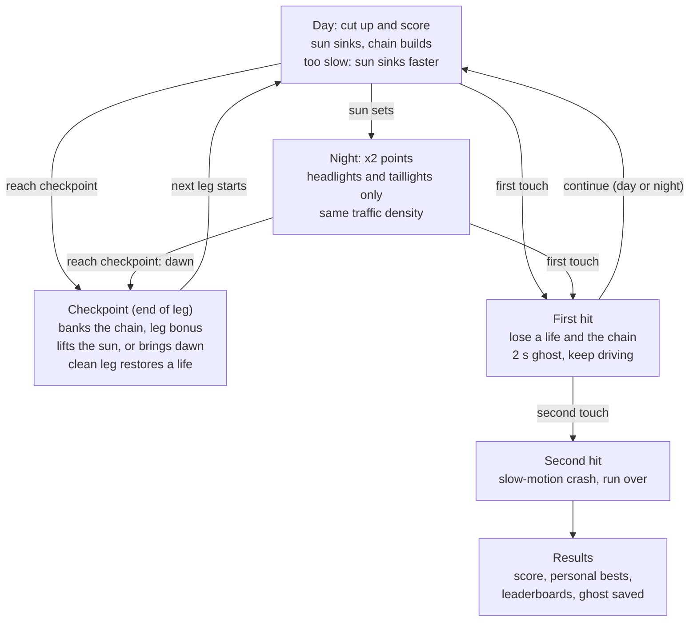

# Westbound — Game Design & Implementation Handoff

Sep 28, 2026

## Overview

Westbound is a mobile-first, landscape, endless highway game: you drive west chasing a setting sun and cut through traffic at high speed. The sun's height is the run's clock and sets every color on screen. No Hesi–style scoring rewards fast, committed lane cuts, and two hits end the run.

It ships natively on iOS and Android first, with a web build from the same codebase second. The engine is Godot 4.7 with GDScript. The reference project is [cool_drive](https://github.com/b3vet/cool_drive): its physics approach, camera modes, design system and thermal lessons carry over.

**Pillars** (in priority order when they conflict):

1. **Traffic is the game.** It must be readable, fair, varied and alive. Without great traffic this is a boring endless drive.
2. **The car must feel perfect.** Heavy, precise, responsive, and consistent at every speed.
3. **The sky tells the story.** One value (the sky timeline) drives both the gameplay state and the whole look.
4. **Performance by construction.** A cheap art direction and a hard budget keep the phone cool without ongoing optimization work.

**Decisions log**

| Topic | Decision | Notes |
| --- | --- | --- |
| Engine | Godot 4.7, GDScript only | Native Metal (iOS) / Vulkan (Android); web export is secondary |
| Concept | Chase the Sun | Car Hopper and Tempo Highway are future modes (see Future modes) |
| Orientation | Landscape only | |
| Steering | One-thumb drag and gyro, switchable | Same steering value feeds physics in both |
| Throttle | Auto-accelerate and manual gas/brake, switchable | Independent of the steering setting |
| Sunset | Night becomes a harder ×2 zone; the run continues | The next checkpoint brings dawn |
| Scoring | No Hesi–inspired cut-up scoring | Multiplier, unbanked chain, banking |
| Lives | 2 | First touch of anything costs one; second ends the run |
| Cameras | Chase, far, hood, overhead (from cool_drive) | Cockpit camera added once new car models have interiors |
| Art | Stylized flat-shaded low-poly; all assets made in-house | AI 3D generators + Blender |
| Cars | cool_drive models are placeholders only | Replaced by modular models: paint, rims, interiors |
| Monetization | None | No ads, no IAP, no ad or second-chance hooks |
| Leaderboards | Game Center + Google Play Games | Web keeps local bests only in v1 |
| Daily Drive | Seed derived from the UTC date | No server needed |
| Traffic side | Right-hand traffic | |
| Title | Westbound | |

## Tech stack and project setup

One Godot 4.7 project in GDScript builds for iOS, Android and web. Simulation code is plain, deterministic GDScript that runs headless, so Claude Code can build and test everything from the command line.

**Engine and renderers**

- **Godot 4.7 stable** (released June 2026). Stay on 4.7.x patch releases for the project's life unless a later version fixes a blocker.
- **Mobile renderer** on iOS (Metal) and Android (Vulkan). **Compatibility renderer** (WebGL 2) for the web build. Every shader and material must look the same under both; check both from milestone 1.
- **Web export:** single-threaded (the default since 4.3), WebGL 2 required. C# cannot export to the web in Godot 4, so the project is **GDScript only** ([Godot web export docs](https://docs.godotengine.org/en/latest/tutorials/export/exporting_for_web.html)).
- **Physics tick:** `physics/common/physics_ticks_per_second = 120`, with physics interpolation enabled so rendering stays smooth at 60 fps. Vehicle and traffic simulation are custom code, not engine rigid bodies.
- **Jolt** (Godot's default 3D physics engine since 4.6) is used only for the final crash tumble.

**Architecture rules**

1. **Pure simulation.** `vehicle_physics`, `traffic_sim`, `scoring`, `sun_clock` and `passability` have no node or scene dependencies. They take state and inputs, return new state, and run headless.
2. **Deterministic by seed.** One run seed derives per-subsystem RNGs (road, traffic, props, events). Same seed and same inputs give the same run. This powers Daily Drive, ghosts and reproducible bug reports.
3. **All constants in data.** Every gameplay number lives in `data/tuning.tres` (like cool_drive's `config.js`). No magic numbers in code.
4. **Event bus.** Scoring and game events go out as signals. HUD, audio, haptics, camera and particles only listen; they never drive gameplay.
5. **Road space first.** Traffic, player position, scoring and collisions are computed in road coordinates (`s` = distance along the centerline, `d` = lateral offset). World transforms are derived for rendering.
6. **Floating origin.** The endless road outruns 32-bit float precision, so re-center the world every 2 km (road, vehicles, props, camera, particles) in one frame, with no visible hitch.
7. **Pooling everywhere.** Road chunks, props, traffic vehicles, particles and audio players come from pools. No allocations in the per-tick simulation loop.
8. **Controller abstraction.** A vehicle is driven through a controller interface (`PlayerController`, `AIController`, later `HopController`). The same vehicle type can be AI or player-driven, which the future modes need.

**Project structure**

```
westbound/
  project.godot
  export_presets.cfg              # iOS, Android, Web
  assets/
    cars/                         # player car .glb + .tscn wrappers
    traffic/                      # traffic vehicle models
    props/                        # roadside instanced props, landmarks
    shaders/                      # world, vehicle, sky, glow, road, decal
    audio/                        # engine loops, SFX, music
    fonts/                        # Chakra Petch 600/700
  data/
    tuning.tres                   # every gameplay constant
    color_script.tres             # sky timeline palettes
    cars/*.tres                   # CarDef resources
    vehicle_types/*.tres          # VehicleType (AI + future player use)
    driver_profiles/*.tres        # IDM/MOBIL parameters per personality
    biomes/*.tres                 # props, tints, lane counts, set-piece mix
    set_pieces/*.tres
  src/
    core/       game.gd (state machine), run.gd, rng.gd, save.gd, settings.gd, events.gd
    road/       road_path.gd, road_builder.gd, roadside.gd, biome_director.gd, floating_origin.gd
    traffic/    traffic_sim.gd, idm.gd, mobil.gd, traffic_director.gd, spawn_sources.gd, passability.gd, traffic_view.gd
    vehicle/    vehicle_physics.gd, player_car.gd, car_visual.gd, hit_response.gd, crash.gd
    scoring/    scoring.gd, score_events.gd
    sun/        sun_clock.gd, color_script.gd, sky.gd
    input/      steering_input.gd, drag_control.gd, gyro_control.gd, throttle_input.gd, keys_gamepad.gd
    camera/     camera_rig.gd
    audio/      engine_audio.gd, sfx.gd, music.gd
    ui/         hud.gd, screens/, theme.tres
    platform/   leaderboards.gd, haptics.gd, thermal.gd, governor.gd
  tests/        run_all.gd + one test script per system
  tools/blender/  batch scripts for the art pipeline
```

**Testing:** `godot --headless --script tests/run_all.gd` runs every test and exits non-zero on failure. The test list lives in each system's section below. A dev HUD (toggled by a three-finger tap, or the backtick key on desktop) shows fps, frame time, draw calls, primitives, render scale, active vehicles, sim time per tick and thermal state.

**Platform services:** Game Center (iOS) and Google Play Games (Android) for leaderboards and achievements, through a thin `platform/leaderboards.gd` wrapper that no-ops on web. A small native plugin per platform reports thermal state (iOS `ProcessInfo.thermalState`, Android `PowerManager.getCurrentThermalStatus`) to the governor.

## Performance budget

The phone must stay cool: a 20-minute session on an iPhone 13-class device at Medium must not thermal-throttle, and a current flagship at High should only get warm. These rules are hard constraints, not goals to optimize toward later.

Why they exist: [cool_drive's optimization audit](https://github.com/b3vet/cool_drive/blob/main/OPTIMIZATION.md) found draw calls (~110) and triangles were not the problem. The heat came from expensive pixels and too many passes: pixel ratio 2, full PBR with a 7-light shader on almost every mesh, shadow maps re-rendered every frame, MSAA, and blurred DOM layers. Westbound avoids each of these by construction.

| Area | Rule |
| --- | --- |
| Frame rate | 60 fps cap in gameplay, 30 fps in menus, optional 30 fps battery-saver setting. Never render above 60 on 120 Hz screens |
| Render resolution | Fixed 3D render scale below native (default 0.75 on Medium; tier table below). UI renders at native resolution |
| Materials | Custom unlit or single-light vertex-lit shaders only. Lighting baked into vertex colors. No `StandardMaterial3D` PBR in gameplay |
| Lights | One `DirectionalLight3D` (the sun) with shadows off. No `OmniLight3D` / `SpotLight3D` in gameplay |
| Night lighting | Emissive geometry, additive glow sprites and road decals only (see World section) |
| Shadows | A blob shadow decal under every vehicle. No shadow maps |
| Post-processing | At most one full-screen pass (color grade). No glow, SSAO, SSR, SSIL, DOF or volumetric fog. "Glow" is faked with sprites |
| Fog | Distance fog computed in the shared world shader; colors from the color script |
| Anti-aliasing | MSAA 2x on High, off on Medium, Low and web |
| Draw calls | 100 or fewer in gameplay. Props via `MultiMeshInstance3D`. Traffic shares materials; per-instance color via instance uniforms |
| Triangles | 150k or fewer visible |
| View distance | Far plane just past the fog end (~700 m). Nothing is drawn fully inside fog |
| Transparency | Minimal overdraw: particles clamped in screen size and count per tier. No large translucent full-screen layers |
| HUD | Godot Control nodes. Labels update only when their value changes. No blur or backdrop effects |
| CPU | Sim ticks allocate nothing. Far traffic (beyond 200 m) simulates at 30 Hz, near traffic at 120 Hz |

**Quality tiers** (Medium is the default on phones):

| Tier | Render scale | MSAA | View distance | Particles |
| --- | --- | --- | --- | --- |
| Low | 0.6 | Off | 500 m | 50% |
| Medium | 0.75 | Off | 700 m | 100% |
| High | 0.9 | 2x | 800 m | 100% |

**Adaptive governor.** If the device reports serious thermal state, or more than 10% of frames miss vsync over a 10-second window, the governor steps down one rung every 10 seconds. The rungs, in order:

1. render scale −0.1 (floor 0.5)
2. particle count −50%
3. view distance −150 m
4. 30 fps

It steps back up one rung after 60 seconds of nominal state, and never above the tier the user picked. It is a separate offset that is never saved over the user's setting. A small "cooling" icon shows while it is active.

**Acceptance test (every milestone from M1):** a 20-minute straight-line drive on a real iPhone 13-class device at Medium must show no thermal throttling and hold 60 fps, with dev HUD numbers recorded.

## Core loop: Chase the Sun

You drive west toward a setting sun that sinks constantly; reaching checkpoints lifts it back up. If it sets, night falls as a harder ×2-points zone until the next checkpoint brings dawn. Only the second hit ends a run.



Day and night alternate as legs pass; hits are the only way out of the loop.

### Sky timeline and sun clock

- **One value drives everything.** `sky_t` runs along the keyframes morning → afternoon → golden hour → sunset → dusk → night → dawn → morning. It sets the sun's position and every palette color (see World).
- **Sinking.** During the day `sky_t` advances toward sunset at a base rate: from the run's starting afternoon to sunset in 5 minutes if never lifted.
- **Too slow.** Below minimum speed it advances 3× faster: you are losing the chase.
- **Checkpoint lift.** Each checkpoint pushes `sky_t` back by 40% of the day span, plus up to 20% more for a fast leg (average speed above the leg's pace target). It never goes earlier than the run's start time.
- **Small nudges.** A thread lifts it 1% of the day span. Five close passes within 10 seconds lift it another 1%.
- **Sun position.** Elevation follows `sky_t`. The road heading keeps the sun 15–30° off the camera axis so it never sits directly behind traffic (see Cameras).
- **HUD.** A thin horizon bar at the top edge shows the sun's height and the distance to the next checkpoint.

### Night

- **×2 on everything scored at night,** including leg bonuses for a leg finished at night.
- **The world goes dark.** Headlights, taillights, street lamps and reflectors carry the scene. Fog gets darker and closer through the color script.
- **Same traffic density** as the day version of that leg. The extra difficulty comes only from seeing less.
- **Night is not a fail state** and has no timer. It lasts until the next checkpoint, which plays a 6-second dawn transition (night → dawn → morning) while gameplay continues. `sky_t` lands at morning.

### Legs and checkpoints

- **Legs.** A run is a sequence of legs, each about 3.5 km of one biome, ending at a checkpoint landmark: express toll gantry, suspension bridge, big sign gantry, or tunnel portal.
- **Warning signs** announce each checkpoint at 1 km and 500 m.
- **Crossing a checkpoint:**
    1. banks the unbanked chain
    2. lifts the sun, or brings dawn at night
    3. pays leg bonuses
    4. restores a lost life if the leg was clean
    5. shows a 2.5-second leg summary toast that does not pause play
- **Leg bonuses:** Clean (no hits), Pace (average speed at or above target), Threads (3 or more in the leg), Heat (multiplier held at 10× or more for 15 s). Night doubles them.
- **Leg objective.** Each leg shows one optional objective on entry, such as "5 close passes", "thread twice" or "no braking". Completing it pays a bonus.
- **Forks.** Some checkpoints split the road OutRun-style into two branches leading to different biomes. Signs name both 1 km ahead; you pick by the side of the road you are on at the split.
- **Difficulty** ramps with leg number (see Traffic).

### The journey goal

- **The coast** is the destination, reached after 8 legs. Arriving plays a finale: the road opens onto the ocean, the camera swings wide, and the sun meets the sea (or city and harbor lights if it is night). A journey bonus is paid and "Journey complete" is recorded.
- **The road continues** as an endless coastal highway for score chasing. The run still ends only on the second hit.

### Modes at launch

- **Journey:** a random seed each run.
- **Daily Drive:** the seed is a hash of the UTC date, so route, forks, traffic and set pieces are the same for everyone that day. Unlimited attempts; the best score counts on the daily leaderboard. Your best daily run is recorded and shown as a translucent ghost car on later attempts (the car's `s`, `d` and heading sampled at 20 Hz).

### Run end

- **Results screen:** total score, distance, legs completed, whether the coast was reached, best chain, best multiplier, threads, close passes, top speed, time spent at night and hits. It compares against personal bests, submits to leaderboards and offers Retry and Garage.
- **Retry** puts the player back on the road within 2 seconds.

## Scoring

Cutting through traffic at speed builds a multiplier, and points collect in an unbanked chain. The chain banks at checkpoints or when you let the multiplier cool off. A hit or hesitation loses it. Speed protects the combo; slowing down drains it.

### Reference: how No Hesi scoring works

No Hesi's exact current formula is not public, and it is retuned every competitive series. It descends from the open "Overtake" script for Assetto Corsa's Custom Shaders Patch and the AssettoServer overtake plugin, whose rules are readable:

- **Minimum speed 80 km/h.** Dropping below resets the combo. Staying below for more than 3 seconds wipes the whole score.
- **Combo decay.** The combo drains constantly. The drain falls to a tenth of its base rate as speed rises from 80 to 200 km/h, and speeds up while wheels are off the road.
- **Overtakes.** Each overtake scores 10 × combo points and adds 1 to the combo. A near miss with an oncoming car adds 1, or 3 when very close. Any collision wipes score and combo.
- **Distances (server plugin).** An overtake counts within 7 m; a close overtake within 4 m triples the score and adds 3 to the multiplier.
- **No Hesi additions.** A bonus multiplier for driving near crewmates, and a shoulder penalty that blocks multiplier gains after too long on the shoulder.

The design idea Westbound keeps: speed protects your combo, hesitation drains it, and points are at risk until secured. The crew multiplier does not apply (single player). Westbound replaces the full score wipe with two lives and chain banking.

### Scoring events

Every event's points = base × multiplier × speed factor × night factor (2 at night, else 1). Speed factor rises linearly from 1.0 at 100 km/h to 2.0 at 250 km/h, clamped.

| Event | Counts when | Base points | Multiplier | Boost |
| --- | --- | --- | --- | --- |
| Pass | A traffic car goes from ahead of you to behind you, centers within 5.4 m laterally (your lane or the next one) | 10 | +1 | — |
| Close pass | A pass with minimum hull-to-hull clearance under 1.0 m during the overlap | 30 (×3) | +3 | +10% |
| Cut | You cross a lane line at 140 km/h or more with a traffic car within 15 m ahead or behind in the lane you left or entered | 15 | +1 | — |
| Thread | Within one 0.5 s window you pass one car on each side, both with lateral clearance under 1.5 m. Paid on top of the two passes | 50 | +5 | +25% |
| Slipstream | Within 15 m behind a traffic car in your lane at 120 km/h or more | none | none | +20% per second |

**Anti-exploit rules**

- A cut needs traffic nearby, so weaving on an empty road scores nothing.
- Each traffic car can contribute to at most one cut per 3 seconds.
- Nothing scores during the 2-second ghost after a hit.
- Passing on the shoulder scores nothing.

### Multiplier

- **Start and cap.** It starts at 1.0× and has no cap. The HUD shows up to 999×.
- **Decay.** It decays by 0.5/s × a speed term that falls linearly from 1.0 at 100 km/h to 0.1 at 250 km/h. At high speed it barely fades, which is the incentive to stay fast.
- **Shoulder.** With any wheel on the shoulder there are no gains and decay is 3×. After more than 2 seconds on the shoulder, gains stay blocked for 3 more seconds after you leave it (the shoulder penalty).
- **Minimum speed (100 km/h).** Below it, the HUD shows TOO SLOW with a speed bar and the multiplier drains at 3/s. The sun also sinks 3× faster.
- **Hesitation.** More than 3 continuous seconds below minimum speed forfeits the unbanked chain ("HESITATED") and resets the multiplier to 1.0.
- **Grace periods.** The minimum-speed rule is inactive until the player first reaches 100 km/h in a run, and for 3 seconds after a hit.

### Chain and banking

- **The chain.** Every event's points go into the unbanked chain, shown big at the top center.
- **Banking:**
    1. crossing a checkpoint
    2. letting the multiplier decay back to 1.0× while staying above minimum speed (cashing out)

    Cashing out takes longer at high speed because decay is slower. That choice between pushing on and cashing out is the core tension.
- **Losing the chain:** any hit, or hesitation. Banked points are never lost.
- **Bonuses.** Leg bonuses, objectives and the journey bonus go straight into the banked total.
- **Final score** = banked total when the run ends. The chain held at the second hit is lost.

### Boost

The boost meter fills from slipstream, close passes and threads. Full meter = 3 seconds of extra thrust and +8% top speed. Boost gives no points directly, but it raises the speed factor and makes the multiplier decay more slowly.

### Score feedback

- **Event messages.** Each event pops a short label with its points (PASS, CLOSE!, CUT, THREAD!, HESITATED) in a stack of 4 lines that slide and fade, like the Overtake script's UI.
- **The multiplier readout** hue-cycles faster as it grows and wobbles above 20×. Glitter bursts on close passes and threads at high multipliers.
- **Banking animation.** The chain flies into the banked total with a count-up and a chime.

### Leaderboards

- **Boards:** Journey best score (all-time and weekly), Daily Drive, and longest distance.
- **Fairness:** camera, control scheme and throttle mode never affect scoring.

Sources: [CSP Overtake script (copy on GitHub)](https://github.com/StewyEarth/AssettoCorsaScripts/blob/main/Overtake.lua) · [AssettoServer overtake plugin docs](https://assettoserver.org/patreon-docs/plugins/PatreonOvertakePlugin/) · [No Hesi](https://nohesi.gg/). The crew multiplier and shoulder penalty come from No Hesi's own promotional and community videos, not a written spec.

## Lives, hits and crashes

The player has 2 lives. The first touch of anything costs a life and the unbanked chain; the second touch ends the run with a slow-motion crash.

**What counts as a hit.** Any contact between the player's collision box and a traffic vehicle, a barrier or guardrail, or a roadside object. Collision boxes are oriented boxes in road space, inset 8 cm from the visual body on each side so near-misses that look clean are clean. Barrier scrapes count: "first touch anywhere" is the rule.

**First hit** (scripted, no physics engine):

- **Loss:** one life, the unbanked chain, and the multiplier drops to 1.0.
- **Player car:** deflects laterally away from the contact, loses 20% speed, and wobbles for 0.6 s. The camera shakes and time slows to 0.5× for 0.3 s.
- **Hit traffic car:** swerves, brakes hard and turns on its hazard lights, then recovers to normal driving after about 4 s. Traffic around it reacts through normal IDM braking.
- **Ghost period:** 2.0 s during which the player flickers translucent, cannot be hit, and cannot score. The minimum-speed rule also pauses for 3 s.
- **Damage:** the car shows it for the rest of the run: smoke from the hood and one flickering headlight on the placeholder models. Real damage states come with the new modular models.
- **HUD:** one life icon breaks. A distinct audio sting and a strong haptic pattern play.

**Life recovery.** A clean leg (checkpoint to checkpoint with no hit) restores a lost life, up to the maximum of 2. This is a tuning switch, on by default.

**Second hit (run over):**

- **Physics hand-off:** the player car and the car it hit become Jolt `RigidBody3D`s at their current velocities, with an impulse from the relative velocity at the contact point.
- **Slow motion:** time drops to 0.25× for 2.5 s while an orbit crash camera frames the tumble. Surrounding traffic brakes.
- **Results:** the results screen fades in after the cinematic. Tapping skips to it at any time.
- **Afterwards:** pooled bodies return to kinematic mode on the next run.

**Fairness rules**

- **Rear-end prevention.** Traffic approaching from behind uses IDM braking with the player as its leader, so it never rear-ends a player driving normally. If the player cuts in front of a faster car with an impossible gap, the resulting contact counts as a hit, because the player caused it.
- **No unfair spawns.** Traffic never spawns overlapping the player or inside the ghost zone.

**Tests**

- **Collision boxes:** hull overlap detection agrees with the inset boxes at speeds up to 350 km/h, with no tunnelling between 120 Hz ticks.
- **First hit:** a scripted first hit leaves the player drivable and above minimum speed within 1 s.
- **Ghost period:** a second contact during the 2.0 s ghost does not count.
- **Life recovery:** a clean-leg restore never exceeds 2 lives.

## Traffic

Traffic is the game. It is simulated like real highway traffic in road coordinates and telegraphs every move. It never ambushes the player, and a director guarantees every pattern it spawns is passable. Build this system with the most care and the most tests.

### Road-space simulation

**Vehicle state:**

- `s`: distance along the road centerline, in meters
- `lane` and `d`: lateral offset from the centerline
- `v` and desired speed `v0`
- length and width
- vehicle type and driver profile
- lane-change state: none, signaling or moving, with its timer
- brake light, blinker and hazard flags

World position and heading come from the road path at (`s`, `d`) each frame, interpolated between ticks. Collision and proximity checks happen in (`s`, `d`) space with oriented boxes; road curvature is gentle enough that this stays accurate.

**Tick rates and budget:**

- **Near:** 120 Hz within 200 m of the player.
- **Far:** 30 Hz for vehicles further away.
- **Cap:** at most 60 active vehicles on the player's carriageway.
- **Player as participant:** the player is part of the simulation, so traffic follows and yields to the player.

### Longitudinal model: IDM

Every vehicle uses the Intelligent Driver Model, which produces natural gaps, braking waves and platoons:

```latex
a = a_{max}\left[1 - \left(\frac{v}{v_0}\right)^{\delta} - \left(\frac{s^*}{s}\right)^2\right], \qquad s^* = s_0 + \max\!\left(0,\; vT + \frac{v\,\Delta v}{2\sqrt{a_{max}\,b}}\right)
```

Here `s` is the bumper-to-bumper gap to the leader, `Δv` the closing speed, `T` the time headway, `s0` the minimum gap, `b` comfortable deceleration and `δ` = 4. Deceleration is clamped to 6 m/s² outside scripted set pieces.

### Lane changes: MOBIL

A car changes lanes only when it gains by doing so. The decision uses MOBIL's incentive and safety criteria:

```latex
\tilde{a}_c - a_c + p\left[(\tilde{a}_n - a_n) + (\tilde{a}_o - a_o)\right] > \Delta a_{th} + a_{bias}, \qquad \tilde{a}_n \ge -b_{safe}
```

- **Terms:** `c` is the changing car, `n` the new follower in the target lane, `o` the old follower. `p` is politeness and `a_bias` the keep-right bias.
- **Player gets extra safety:** when the player would be the new follower, `b_safe` tightens to 2 m/s², and the no-ambush rule below also applies.
- **Execution:** blinker on for the profile's signal time, then a smoothstep lateral move over the move time. Heading follows the lateral velocity so the car visibly points into the lane.

### Fairness rules (non-negotiable)

1. **Telegraph every lane change.** The blinker runs 1.0 s before any lateral motion (aggressive drivers 0.6 s, never under 0.5 s). The lateral move takes 2.0–3.0 s (aggressive 1.5 s).
2. **No ambush.** A car may not start a lane change into space the player is predicted to occupy within the next 1.5 s, using the player's current `s`, `v` and lateral velocity plus a 1.0 m margin. If the player enters the target gap while the car is signaling, it cancels: blinker off, stays in lane.
3. **Readable braking.** Brake lights come on at any deceleration above 1 m/s² and glow brighter above 4 m/s².
4. **No sudden stops.** Deceleration never exceeds 6 m/s² except in set pieces announced at least 300 m ahead.
5. **No visible pop-in.** Vehicles spawn beyond the fog end ahead, or behind the camera frustum.
6. **Blind crests and bends.** Within 150 m after a blind crest or bend, the director caps density at 60% and allows no set pieces. Warning signs precede sharp sections.
7. **Lane discipline.** Right-hand traffic. Each lane has a flow speed that rises toward the left; slow profiles keep right.

### Driver types

| Type | Vehicles | Desired speed | Behavior |
| --- | --- | --- | --- |
| Cruiser | Sedan, hatchback | 80–100 km/h | Keeps right, high politeness, rare lane changes |
| Commuter | Sedan, SUV, pickup | 100–130 km/h | Standard IDM/MOBIL, moderate lane changes |
| Aggressive | Sports car, coupe | 150–190 km/h | Short headway, low politeness, frequent lane changes, 0.6 s blinker, passes the player from behind |
| Truck | Semi | 80–90 km/h | 16 m long, keeps right, slow acceleration, blocks sightlines |
| Bus | Coach | 85–95 km/h | 12 m long, right lanes |
| Van | Delivery van | 95–110 km/h | Tall, blocks sightlines, moderate |
| Motorbike | Sport and touring bikes | 110–150 km/h | Narrow; splits lanes in slow traffic (clearly visible, never during the player's lane change) |
| Hesitant | Any car | 90–120 km/h | Signals, then cancels about 20% of the time. From leg 3 onward only |

IDM and MOBIL parameters live per profile in `data/driver_profiles/`. Colors come from the biome palette through per-instance color.

### Traffic reacts to the player

- **Night tailgating:** high beams flash when the player tailgates within 10 m for over 1 s.
- **Close passes:** a horn sounds after about 30% of them, with doppler.
- **Tight cut-ins:** a brake tap when the player cuts in less than 10 m ahead.
- **After a hit:** hazard lights.
- **Blind spot:** an occasional horn when the player lingers in a car's blind spot for over 3 s.

### Spawning and the opposite carriageway

- **Ahead:** vehicles spawn about 750 m ahead (past the fog end) at their lane's flow speed, with IDM-consistent gaps.
- **Behind:** faster vehicles spawn about 150 m behind in the left lanes, only when the player is slower than them and the spawn point is outside the camera frustum.
- **Despawn:** 200 m behind the player, or when beyond the active window.
- **Opposite carriageway:** visual-only traffic across the median. It runs at constant speed with no collision and at lower density, and shows headlights at night.

### Traffic director

The director controls density, lane speeds, type mix and set pieces through a pluggable `SpawnSource` interface. Built-in sources: Flow (default), SetPiece, and Daily (Flow seeded by date). Future sources: Beatmap (Tempo Highway) and HopTargets (Car Hopper).

- **Intensity waves.** Tension and release in cycles of 45–90 s: build, peak (often a set piece), then a 10–15 s breather. Every leg ends with a short breather before the checkpoint.
- **Difficulty by leg:**
    - density rises from 8 to 16 vehicles per km per lane from leg 1 to leg 8, then holds
    - the aggressive share rises from 5% to 20%
    - Hesitant drivers enter from leg 3
    - set piece variety grows
- **Night:** same density as day for that leg.

| Set piece | What happens | Warning |
| --- | --- | --- |
| Truck wall | Trucks and buses roll side by side across all lanes but one; the open lane shifts slowly | Visible from distance by silhouettes |
| Rolling roadblock | Cars at matched speed across all lanes; a gap opens every few seconds | Brake lights ripple as it forms |
| Merge zone | On-ramp adds traffic from the right, then the right lane ends | Signs 500 m and 250 m ahead |
| Road works | One or two lanes closed by cones and a barrier; traffic merges | Signs 400 m ahead, flashing arrow board |
| Slalom | Staggered cars across lanes forming an S-line of gaps | None needed (all visible) |
| Convoy | A slow line of same-color vehicles with hazards on, honking | Visible |
| Tunnel squeeze | Two lanes, tighter traffic, light change at entry and exit | Tunnel portal |
| Toll gantry | Checkpoint landmark: booth lanes on the sides, open express lanes in the middle | Signs 1 km and 500 m ahead |

### Passability guarantee

Before committing any spawn batch (the next ~300 m), the director runs `passability.gd`:

1. **Forward-simulate** traffic at 10 Hz for 8 s.
2. **Search player moves** over a grid of lateral positions (lane centers and half-lanes) in 0.25 s steps. Moves are limited by the player car's real lane-change capability at its current speed (from vehicle physics tuning). Speed is allowed anywhere from minimum speed to current speed plus possible acceleration.
3. **Require a path** that stays at or above minimum speed and never comes within 0.3 m of a hull. Without one, re-roll the batch (up to 5 times), then remove the vehicle that blocks the most paths.

The same module runs in tests with a bot driver.

### Visuals

- **Lights:** brake lights, blinkers, hazards, headlights and taillights, all emissive with glow sprites.
- **Motion:** wheels spin with speed, bodies roll and pitch slightly, and lane changes show visible yaw.
- **Rendering:** vehicles are pooled per model with shared materials; the color is a per-instance uniform.

### Traffic sandbox (debug scene)

A dedicated scene for tuning, with:

- a free camera, time scale control and pause/step
- spawn controls
- overlays for each vehicle's IDM gap and target speed, MOBIL decisions with incentive values, blinker timers, the player's predicted occupancy, and the passability paths the director found

Traffic quality gets tuned here.

### Tests (headless)

- **Soak:** 10,000 simulated km with a bot driver produce zero impossible windows and zero traffic-to-traffic collisions.
- **Rule checks:** zero lane changes shorter than the minimum signal time, and zero no-ambush violations.
- **Determinism:** the same seed gives an identical traffic trace (hash of all vehicle states every second).
- **Logged metrics per build:** gaps per km, lane changes per vehicle per minute, mean speed per lane, set pieces per leg. A regression beyond ±15% on any of them fails the test.

## Car physics and feel

The car drives on grip with visible weight: a hand-rolled bicycle model at 120 Hz. The single most important number is lane-change time at speed, which is specified, tested and tuned together with traffic density and lane width.

**Model** (`vehicle_physics.gd`, a pure function `step(state, input, dt, params) -> state`, ported from the approach in [cool_drive's physics](https://github.com/b3vet/cool_drive)):

1. **Split velocity.** Break world velocity into forward and lateral parts in the car's frame.
2. **Longitudinal forces.** Engine force from the car's acceleration curve, aero drag (∝ v²), rolling resistance, braking at 9 m/s² and boost thrust. Top speed emerges from drag.
3. **Lateral grip.** High cornering stiffness scrubs lateral velocity, with only a small slip at the limit. There is no drift assist; this is grip driving.
4. **Yaw.** A grip-limited bicycle model plus yaw damping and a hard slip-angle clamp of 8°.
5. **Road-relative steering.** Road curvature is fed forward, so zero input keeps the car parallel to the lane through curves. This is not lane-centering: lateral position is never corrected for the player.
6. **Road surface.** Height and pitch come from road elevation at (`s`, `d`); shoulders and barriers come from the road profile.

**Steering pipeline:** input (−1 to 1) → speed-sensitive maximum steer angle (30° at 0 km/h easing to 3.5° at 250 km/h) → rate limit (full lock in 0.12 s) → steer angle. On release the car straightens, critically damped, with no oscillation.

**Lane-change time targets** (move 3.6 m sideways and settle straight; full input then release):

| Speed | Target time | Tolerance |
| --- | --- | --- |
| 100 km/h | 0.80 s | ±5% |
| 200 km/h | 1.00 s | ±5% |
| 280 km/h | 1.15 s | ±5% |

A car's handling stat scales these by 0.9–1.1. The passability check reads the same curve, so traffic difficulty and car capability can never disagree.

**Visual body motion** (`car_visual.gd`, visual only, never feeds back into physics):

- **Body:** yaw into lane changes, taken straight from physics. Roll up to 4° from lateral acceleration and pitch up to 2° from longitudinal acceleration, through a spring-damper (about 2.5 Hz, damping ratio 0.6).
- **Wheels:** spin with speed, and the front wheels show the steer angle.
- **Braking effects:** brake lights on the player car. Tire smoke and a brief squeal on braking above 4 m/s² at over 150 km/h.
- **Gearbox:** a simulated 6–7 speed automatic, for engine audio and a tiny acceleration dip on each shift.

**Car stats** (`CarDef` resource):

- **Stats:** top speed 240–300 km/h, acceleration, braking, handling (the 0.9–1.1 scale above) and boost capacity.
- **Narrow spread:** every stat stays within about ±10% across the roster, so one leaderboard stays fair. There are no upgrades.

**Units:** km/h by default, with an mph option.

**Feel targets:**

- Input to visible yaw in under 50 ms.
- Holding full input never spins the car.
- Braking from 250 to 100 km/h takes about 1.3 s.
- Boost is felt within 0.1 s through a field-of-view punch, sound and thrust.

**Tests (headless):**

- **Lane-change time** at 100, 200 and 280 km/h within tolerance, for each car.
- **Settling:** overshoot under 5% of lane width after release, and lateral drift under 0.3 m within 1 s of release.
- **Straight-line stability:** zero input for 60 s on a curved road section keeps the car in its lane (drift under 0.3 m).
- **Performance specs:** top speed and 0–200 km/h time within 2% of each car's spec.
- **Determinism:** the same input trace gives an identical state trace.
- **Robustness:** no NaN or explosion under random input fuzzing for 10 simulated minutes.

## Controls

Steering (drag or gyro) and throttle (auto or manual) are two independent settings, giving four layouts in landscape. Every layout outputs the same signals: steering −1 to 1, throttle 0 to 1, brake 0 to 1, and a boost trigger. Physics and scoring cannot tell them apart.

| | Auto-accelerate | Manual gas and brake |
| --- | --- | --- |
| **Drag steering** | One thumb does everything: left/right steers, drag down brakes, flick up boosts | Left thumb steers in a drag zone on the left half; right thumb holds a gas pedal, with brake and boost buttons beside it |
| **Gyro steering** | Tilt steers; touch and hold anywhere to brake, swipe up to boost | Classic layout: brake pedal bottom-left, gas pedal bottom-right, boost button above gas |

**Mirroring.** A left-handed option mirrors every layout.

**Drag steering** (`drag_control.gd`):

- **Anchor.** A floating anchor appears where the thumb lands inside the steering zone. The zone is the whole screen minus UI buttons in auto mode, and the left half in manual mode.
- **Steering value.** Horizontal offset from the anchor gives `steer = sign(x) · curve(|x| / max_drag)`.
    - `max_drag` = 2.5 cm of physical screen distance (via screen DPI)
    - dead zone 4%
    - response curve exponent 1.6
- **Anchor follow.** If the thumb goes past `max_drag`, the anchor follows it, so re-centering is always one small move.
- **Release.** Steering returns to 0 over 80 ms.
- **Auto mode verticals:**
    - dragging down more than 30% of `max_drag` brakes, proportionally
    - a quick upward flick (over 0.6 m/s of finger speed) fires boost when the meter allows
- **Indicator.** A faint ring shows the anchor and a dot shows the thumb, both in the design system's accent color.

**Gyro steering** (`gyro_control.gd`):

- **Tilt source.** Tilt comes from the gravity vector (`Input.get_gravity()`), which is steadier than integrating raw gyro rates. It is measured as roll around the screen's long axis relative to a calibrated neutral.
- **Steering value.** `steer = curve(clamp(angle / max_angle))`:
    - max angle 25°
    - dead zone 2°
    - low-pass smoothing 60 ms
    - same response curve exponent as drag
- **Orientation.** Landscape-left and landscape-right are both handled; flipping the phone mid-run flips the sign correctly.
- **Calibration.** Neutral is captured during the 3-2-1 countdown at run start. A Recalibrate button sits in the pause menu.
- **Web build.** Gyro on the web needs verification: iOS Safari asks for motion permission from a user gesture. If that is not reliably reachable from Godot's web export, gyro is native-only in v1 and the web setting is hidden.

**Manual throttle:**

- **Gas:** holding the gas pedal gives full throttle (analog is unnecessary on glass).
- **Coasting:** releasing it coasts under engine braking.
- **Brake:** the brake pedal is proportional to how far up the pedal the thumb sits.

**Keyboard and gamepad (web and desktop testing):**

- **Keyboard:** A/D or ←/→ steer with a 0.15 s ramp. W/↑ is gas (manual mode), S/↓ brake, Shift boost, C camera, P or Esc pause, M mute.
- **Gamepad:** left stick steers, right trigger gas, left trigger brake, A boost, Y camera.

**Settings and first run:**

- **Settings:**
    - steering mode and throttle mode
    - sensitivity (scales `max_drag` and max angle), dead zone and response curve
    - left-handed mirror, haptics on/off, units
- **First launch.** A one-screen chooser for steering and throttle (default: drag + auto), then a 20-second empty-road warm-up so players feel it before traffic. The chooser can be revisited from settings.

**Tests:**

- **Mapping:** the steering curve maps correctly at the dead-zone edge, the midpoint and full input.
- **Gyro:** the sign is correct in both landscape orientations.
- **Drag anchor:** the anchor follows when the thumb goes past `max_drag`.
- **Keyboard:** the steering ramp reaches full input in 0.15 s.
- **Equivalence:** all four layouts produce identical physics for the same input values.

## Cameras

All four of cool_drive's camera modes carry over: chase (default), far chase, hood and overhead. A cockpit camera is added once the new car models have interiors. Camera choice never affects scoring.

| Mode | Placement | Notes |
| --- | --- | --- |
| Chase | Behind and above, spring-damped follow | Default. Best balance of speed feel and reading traffic |
| Far chase | Further back and higher | Easiest traffic reading at high speed |
| Hood | On the hood, low | Strongest sense of speed; hardest at night |
| Overhead | High, looking down and forward | Reads the whole lane layout; a good accessibility option |
| Cockpit (later) | Driver's eye inside the cabin | Needs modular car models with interiors and a camera marker node |

**Behaviors shared by every mode:**

- **Spring follow.** A spring-damped follow on position and heading, as in cool_drive's camera.js.
- **Speed response.** Field of view widens from 62° at 100 km/h to 78° at top speed, and chase distances pull back up to 15%.
- **Look-ahead.** The look target shifts up to 1.2 m toward the lateral velocity, so you see the lane you are moving into.
- **Roll and shake.**
    - subtle roll with lateral acceleration (up to 1.5°)
    - shake on hits
    - a tiny shake on close passes
    - a field-of-view punch on boost
- **Reduced motion.** The setting turns off shake, roll and the field-of-view punch.
- **Cycling.** A HUD button or the C key cycles modes; the choice is saved.

**Glare rule.** Driving west into a low sun puts traffic in silhouette in front of the camera. Readability wins:

- **Sun placement.** The road generator keeps the heading so the sun sits 15–30° off the camera axis, never directly behind traffic in chase view.
- **Rim light.** Traffic gets a sun-colored rim term in the vehicle shader, strongest when backlit.
- **Lights.** Taillights and brake lights are always emissive, day and night.

**Scripted cameras:**

- **Crash:** an orbit around the tumble at 0.25× time.
- **Journey finale:** a 3-second wide swing onto the ocean at the coast. It runs during a traffic-free breather while the car holds its lane.
- **Menu:** a slow drive-by of the selected car on the road. No scripted camera ever takes control while traffic can still hit the player.

## World, road and visual direction

The look is stylized, flat-shaded low-poly, not realism: cool_drive's world style, with color grading as the star. One value, the sky timeline, drives every color on screen, so the whole game's mood follows the gameplay state for the cost of a few shader uniforms.

### Road

- **Layout.** A divided highway, 3 lanes per direction by default. Some biomes use 4; tunnels and road works drop to 2.
    - lanes 3.6 m wide
    - shoulders 3.0 m
    - a median barrier, with the opposite carriageway and its visual-only traffic visible across it
- **Geometry.** A procedural, seeded centerline:
    - long gentle curves, radius 1,200 m or more
    - grades up to 5%, with occasional blind crests (see traffic fairness rule 6)
    - built as ribbon mesh chunks 200 m long, pooled, with the floating origin every 2 km
- **Markings.** Dashed lane lines (the main speed rhythm), solid edge lines, and raised reflectors that glow at night.
- **Roadside rhythm** (all `MultiMeshInstance3D`): light poles every 50 m, reflector posts every 25 m, guardrail posts, sign gantries, billboards with invented brands, fences. This rhythm sells speed and is nearly free.

### Color script

`data/color_script.tres` holds keyframes along `sky_t`: morning, afternoon, golden hour, sunset, dusk, night, dawn. Each keyframe sets:

- **Sky:** zenith and horizon colors; sun disc color, size and glow; cloud lit and shadow colors.
- **Atmosphere:** fog color, fog start and fog end distance; horizon silhouette tints per depth layer.
- **Lighting:** ambient color, sun light color and intensity, and the shadow-side tint used by the vertex-lit shader.
- **Surfaces:** road tone and lane-line tint.
- **Lights:** emissive intensity for headlights, street lamps and reflectors, which ramps up from dusk.

The game interpolates channels between keys every frame and pushes them as global shader uniforms (one update per frame). Biomes can add tint offsets (desert warmer, coast cooler) without their own palettes. The resource is editable in the inspector, and a debug slider scrubs `sky_t` live.

### Sky

- **Dome:** a gradient sky shader, a sun disc and a glow sprite, plus stars that fade in at night.
- **Clouds:** flat cloud cards lit with the sun color.
- **Horizon:** 3–4 layered silhouette cards (mountains, mesas, city skyline) at increasing distance, tinted toward the fog color for atmospheric depth. They scroll with parallax and are cheap and very pretty.

### Biomes

Each leg is one biome. Default order below; forks swap the next biome. Time of day comes from the sun, not the biome, so every biome must look good across the whole color script.

| # | Biome | Signature props and features |
| --- | --- | --- |
| 1 | Farmland plains | Golden fields, silos, windmills, water towers, long views |
| 2 | Desert mesas | Red rock mesas, cacti, long straights, fake heat shimmer near the horizon |
| 3 | Canyon pass | Cliffs, tunnels, more curves and crests |
| 4 | Coastal highway | Ocean on one side, cliffs, suspension bridge; the sun sinks into the sea |
| 5 | City at night | Skyline, elevated highway sections, neon billboards |
| 6 | Valley fog | Low fog layers in valleys (cards), forests, dawn-friendly palette |

**Biome data** (`data/biomes/*.tres`): prop sets and densities, tint offsets, lane count, set-piece mix, horizon silhouette set and checkpoint landmark style.

### Night lighting (no real lights)

- **Traffic headlights:** emissive quads, additive glow sprites and a light-cone decal on the road.
- **Traffic rear lights:** taillights, brake lights and blinkers as emissive geometry with glow sprites.
- **Street lamps:** emissive heads and light-pool decals on the road.
- **Player headlights:** a cone decal on the road, plus a "fake light" uniform (position and direction) in the shared world shader that brightens nearby surfaces.
- **Reflectors and signs:** retro-reflective material that brightens when inside the player's headlight cone.

### Checkpoint landmarks

Express toll gantry, suspension bridge, big sign gantry with the leg name and distance, tunnel portal. Each is a hand-built scene per biome style, announced by signs at 1 km and 500 m.

**Out of scope for v1:** weather (rain at night and fog banks are later candidates).

## Audio, haptics and game feel

The pass whoosh is the most important sound in the game: every car you pass must be heard, and closer passes must sound sharper. Every scoring event gets sound, haptics and a visual response within one frame.

**Audio**

- **Engine:** recorded loops at several RPM steps, on- and off-throttle, crossfaded and pitched by the simulated RPM, with gear-shift dips. It replaces cool_drive's synthesized Web Audio engine.
- **Pass whoosh:** a doppler whoosh per passed car, louder and shorter with smaller clearance. Close passes add a sharp "zip" layer; threads add a low thump.
- **Traffic:** horns with doppler, a truck air-brake hiss and tire hum. Tunnel sections switch the bus to a reverb.
- **Wind:** noise rising with speed; boost adds a whoosh and an intake roar.
- **Scoring stingers:** short musical tones for events, pitched up as the multiplier grows. Banking plays a count-up chime; HESITATED and hits get distinct stings.
- **Music:** v1 ships a small set of tracks. Night applies a low-pass filter and reverb to the music bus. Porting cool_drive's generative radio (via `AudioStreamGenerator`) is a stretch goal.
- **Buses:** Master, Music, SFX, Engine and UI, each with a volume setting.
- **Assets:** recorded audio must be sourced or produced separately (licensed packs or recorded); Claude Code can wire it but not create it well.

**Haptics** (`platform/haptics.gd`, toggle in settings):

| Event | Pattern |
| --- | --- |
| Pass | Light tick |
| Close pass | Medium tick |
| Thread | Heavy thump |
| Banking | Double light tick |
| Hit | Strong burst, 150 ms |
| Crash | Long rumble, 400 ms |

**Game feel (juice):**

- **Slow motion:** thread 0.6× for 0.25 s, first hit 0.5× for 0.3 s, crash 0.25× for 2.5 s.
- **Speed effects:** speed lines and wind-streak particles above 180 km/h, and a field-of-view punch on boost.
- **Camera:** shake on hits (reduced-motion setting disables it).
- **HUD:** the chain number pulses on each event, the multiplier hue-cycles and wobbles above 20×, and glitter bursts fire on high-multiplier close passes and threads.
- **Particles:** tire smoke on hard braking, and sparks on barrier scrapes (the scrape is still a hit).

## UI, HUD and design system

cool_drive's "Low-poly arcade" design system carries over whole: faceted cut-corner panels, thin neon edges, speed-tilted type, Chakra Petch. The HUD lives on the screen edges so the middle third stays clear for traffic.

```text
+--------------------------------------------------------------------------+
| BANKED               [sun ======o---------]           [#][#]  [II] [CAM] |
| 1,284,500          next checkpoint 1.2 km             2 lives            |
| BEST 2,010,000       CHAIN 48,200   12.4x                                |
|                        CLOSE! +1,450                                     |
|                        PASS +480                                         |
|                  .- - - - - - - - - - - - -.                             |
|                  :                          :                            |
|                  :  middle third stays      :            ( o )           |
|                  :  clear for reading       :     floating drag anchor   |
|                  :  traffic                 :                            |
|                  '- - - - - - - - - - - - -'                             |
| 212 km/h                                            BOOST                |
| [=========|======    ]  min 100 bar                 [==========      ]   |
+--------------------------------------------------------------------------+
```

Score sits top-left, the chain and multiplier top-center under the sun bar, and lives and buttons top-right. Speed is bottom-left and boost bottom-right; the drag anchor appears wherever the thumb lands.

### Design system (from [cool_drive DESIGN.md](https://github.com/b3vet/cool_drive/blob/main/DESIGN.md))

- **Faceted panels.** Cut corners, no bubbly radius. In Godot use `StyleBoxFlat` with `corner_radius_*` set to the bevel size and `corner_detail = 1`: that turns rounded corners into straight chamfers. Bevel 13 px on panels, 7 px on small controls.
- **Neon edge.** A 1.5 px border in the line color; selected and hover states switch the border to the accent and add a glow. Use a small glow sprite or shader behind the control, never a blur.
- **Speed tilt.** The logo, chain and multiplier readouts and celebrations are skewed about −7° with a small `canvas_item` shader. Cards lean slightly (translate and rotate) on focus.
- **Type.** Display: Chakra Petch 600/700 (bundled font files) for the logo, uppercase tracked labels, buttons and every HUD readout, with tabular numbers. Body: the system font.
- **Colors:**

| Role | Value |
| --- | --- |
| Ink / background | #0b1020 |
| Panel | #111a30 |
| Text | #f4f7ff |
| Muted text | #8a93ad |
| Gold (records) | #ffd24a |
| Hot (brake, hits) | #ff5a4d |
| Accent | Follows the color script (the sky's neon), set every frame from `sky_t` |

- **Layout.** Left-anchored layouts on a faint 46 px grid, not centered everything; 8 px spacing grid.
- **Anti-patterns (never):** gradient pill buttons, gradient-clipped logo text, uniform bubbly radius, frosted-glass panels with no edge, purple/violet default accents, centered symmetric layouts.
- **Implementation.** One Godot `Theme` resource (`ui/theme.tres`) holds all of the above.

### HUD elements

- **Top-left:** banked score and personal best.
- **Top-center:** the sun bar (sun height and distance to the next checkpoint); below it the chain value and multiplier, then the event message stack (4 lines).
- **Top-right:** 2 life icons, pause and camera buttons.
- **Bottom-left:** speed. The minimum-speed bar appears only when speed nears or drops below 100 km/h.
- **Bottom-right:** boost meter.
- **Controls overlay:** the drag anchor ring (drag modes) or pedals and buttons (manual and gyro modes), mirrored for left-handed play.
- **Safe areas:** everything respects notches and home indicators.
- **Update rule:** labels change only when their value changes; nothing animates when idle.

### Screens

- **Title:** the attract camera drives the selected car; Play, Daily Drive, Garage, Leaderboards, Settings.
- **Garage:** car select, paint and rims (see Cars).
- **Settings:**
    - controls (steering mode, throttle mode, sensitivity, dead zone, curve, left-handed)
    - graphics tier and battery saver
    - audio buses
    - haptics, units, camera, reduced motion
- **In run:** countdown (gyro calibration happens here), pause menu (resume, recalibrate, settings, quit).
- **Leg summary:** a non-blocking toast.
- **Results:** stats, personal-best comparison, Retry and Garage.

### Accessibility

- **Reduced motion:** turns off camera shake, camera roll, the field-of-view punch and slow motion.
- **Color independence:** event messages never rely on color alone; every event has its own word and sound.
- **Text size:** an option (100% / 125%) for HUD and menus.

## Cars, garage, progression and art pipeline

cool_drive's three cars (Falcon GT, Night Viper, Brute V8) are placeholders only. The real roster will be new modular models made in-house with AI 3D generators and Blender, built so paint, rims, damage and a cockpit camera work. Code must depend on the node convention below, never on a specific model.

### Modular car convention

All cars face −Z with Y up, in meters, with the origin on the ground at the center between the axles.

```
Car_<name>                       Node3D root
  Body                           mesh; material slots: paint, trim, glass
  Lights                         emissive meshes: headlight_L/R, taillight_L/R,
                                 brake_L/R, blinker_FL/FR/RL/RR, reverse
  Wheel_FL, Wheel_FR             steer pivots at hub centers
    Rim                          swappable mesh (scaled to wheel radius)
    Tire
  Wheel_RL, Wheel_RR
    Rim
    Tire
  Interior                       dashboard, seats, SteeringWheel (rotates with steer)
  Markers                        cam_cockpit, cam_hood, exhaust_L/R, smoke_hood, shadow
  Damage (later)                 alternate bumper_F/R and hood meshes
```

| Asset | Triangles (LOD0 / LOD1) | Materials |
| --- | --- | --- |
| Player car body | 15k / 5k | Paint, trim, glass, lights |
| Player car interior | 5k (cockpit camera only) | Shared interior |
| Traffic vehicle | 3k / 1k | One body material + lights; color per instance |
| Rim | 800 | Shared |

**Car shader.** Vertex-lit with one light, plus a matcap lookup for paint sheen (one texture read). Paint color and optional livery mask are shader parameters, so recoloring costs nothing. No PBR.

### Art pipeline

1. **Generate or model.** Use an AI 3D generator or Blender; silhouette first, chunky proportions.
2. **Blender batch scripts** (`tools/blender/`) do the cleanup:
    1. normalize scale and axes, apply transforms
    2. decimate to budget, flat-shade
    3. bake vertex colors or map to the shared 256² palette atlas
    4. rename nodes to the convention, then export `.glb`
3. **Godot import script** (`EditorScenePostImport`) does the wiring:
    - assigns project shaders by material name and builds the collision box from the body bounds (inset 8 cm)
    - registers markers and generates LOD1
4. **Validation test** (`tests/check_car_assets.gd`) fails the build on missing nodes, over-budget meshes, wrong orientation or wrong scale.

One style guide sheet (palette of about 30 colors, flat shading, no photo textures) keeps AI output consistent with the world. The same pipeline handles traffic vehicles, props and landmarks.

### Traffic roster

About 14 models at launch: 3 sedans, 2 hatchbacks, 2 SUVs, a pickup, a delivery van, a semi with 2 trailer variants, a coach bus, 2 motorbikes and 2 sports cars. Colors come from the biome palette per instance.

### Garage and progression

- **Roster.** 8 player cars at launch; 1 unlocked at start. Stats stay within about ±10% of each other, with no upgrades.
- **Driver level.** Lifetime banked score feeds a driver level. Levels unlock cars, paint colors and rims.
- **Milestone unlocks.** Some cars unlock from milestones instead: reach leg 4, reach the coast, a 7-day Daily Drive streak, 100 lifetime threads.
- **Cosmetics.** Paint colors and rims now; liveries later. The garage shows the car on a turntable with the current sky palette.
- **Achievements.** About 25 achievements, mirrored to Game Center and Google Play Games (for example: first thread, 50× multiplier, a clean journey, a full night survived, 300 km/h).
- **No store, no currency, no monetization.** No ads, no in-app purchases, and no hooks for them.

### Save data

A local, versioned save in `user://` holds settings, unlocks, stats, personal bests and Daily Drive ghosts. Leaderboard scores live on the platform services. Cloud save is out of scope for v1.

## Future modes

Car Hopper and Tempo Highway are planned modes after launch. They are not built in v1, but v1's architecture must include the hooks below so they can be added without rewrites.

### Car Hopper

You don't own a car; you leap between vehicles in traffic.

- **The hop.** Swipe toward a vehicle; time slows while you aim; you land on it and take the wheel.
- **Every vehicle plays differently:**
    - a bus shoves traffic aside
    - a motorbike splits lanes
    - a car-carrier truck works as a ramp
    - a sports car is fast but fragile
- **Pressure.** Your current ride degrades, so you keep hopping.
- **Taming.** Ride a rare vehicle long enough and it joins your garage.
- **Lineage.** Rodeo Stampede proved this loop with animals; it hasn't been done in traffic racing.

### Tempo Highway

Traffic is generated from the music.

- **Gaps on the beat.** Gaps open on the beat and lane changes on the beat score "perfect".
- **The drop.** It triggers a boost and a world-wide flash.
- **Generator.** cool_drive's generative music engine could drive both the song and the road from one generator.
- **Latency.** Rhythm needs tight audio latency and an audio-latency calibration screen, which native builds make possible.

### Hooks to build in v1

| Hook | Where | Used by |
| --- | --- | --- |
| Vehicles are data (`VehicleType` + `DriverProfile`), usable by AI or player | `data/vehicle_types/`, `vehicle_physics.gd` params per type | Car Hopper |
| Controller interface (`PlayerController`, `AIController`); a traffic vehicle can switch controller at runtime without respawning | `src/vehicle/` | Car Hopper |
| Per-type physics profiles (mass, grip, lane-change time, shove strength) | `VehicleType` resource | Car Hopper |
| `SpawnSource` interface for the traffic director | `src/traffic/spawn_sources.gd` | Tempo Highway (Beatmap), Car Hopper (HopTargets) |
| Scoring rules as a swappable rule set per mode | `src/scoring/` | Both |
| Mode state machine with per-mode HUD sections | `src/core/game.gd`, `src/ui/` | Both |
| A music clock the sim can read (beat phase, bar) | `src/audio/music.gd` | Tempo Highway |

## Implementation milestones

Build in this order. Each milestone is done only when its headless tests pass, the on-device 20-minute soak (from M1) passes, and a short playtest note is written. The art pipeline runs as a parallel track from M1.

**Working rules for Claude Code:**

- **Test first on systems:** write the headless tests with each system, not after it.
- **Data over code:** tuning values go in `data/tuning.tres`, never in code.
- **Rendering rules:** never add lights, shadow maps, PBR materials or post effects beyond the performance budget.
- **Visual review:** keep the traffic sandbox and dev HUD working at every milestone; they are how the feel gets reviewed.
- **When plans change:** if a decision in this document must change, flag it rather than silently diverging.

**Milestones:**

1. **M0 Foundation.**
    - Deliverables: Godot 4.7 project with the folder structure; `tuning.tres`; seeded RNG; event bus; headless test runner; dev HUD; export presets for iOS, Android and web.
    - Done when an empty scene runs on an iPhone, an Android phone and a desktop browser, and `run_all.gd` runs green from the command line.
2. **M1 Road and look.**
    - Deliverables: procedural road chunks with curves and elevation; floating origin; roadside MultiMesh props; world, sky and road shaders; color script with a live `sky_t` debug slider; one biome (farmland); blob shadows; quality tiers.
    - Done when an empty-road 20-minute drive holds 60 fps with no thermal throttling on an iPhone 13-class device at Medium, and it looks right across the whole color script on both renderers.
3. **M2 Car, controls, cameras.**
    - Deliverables: vehicle physics; car visual motion; all four control layouts plus keyboard and gamepad; the four camera modes with speed FOV and look-ahead; placeholder cool_drive car imported via the modular convention (missing nodes stubbed).
    - Done when the lane-change time, settling and stability tests pass, and the drag and gyro layouts both feel precise on device.
4. **M3 Traffic.**
    - Deliverables: road-space sim with IDM and MOBIL; the eight driver types; telegraphing and all fairness rules; spawning and despawning; the opposite carriageway; traffic lights and visuals; the traffic sandbox scene.
    - Done when the 10,000 km soak, determinism and fairness tests pass, and a 10-minute sandbox review shows readable, lively traffic.
5. **M4 Scoring and lives.**
    - Deliverables: all scoring events; multiplier, chain and banking; minimum speed and hesitation; shoulder penalty; boost; lives, hits, ghost period and damage look; the Jolt crash; HUD and event messages; results screen.
    - Done when scoring unit tests (every event, anti-exploit rules, banking, loss cases) pass, and a first full playable loop works.
6. **M5 Sun loop and legs.**
    - Deliverables: sun clock and sky timeline gameplay; night with ×2 and dawn at checkpoints; legs, checkpoint landmarks and signs; leg bonuses, objectives and clean-leg life restore.
    - Done when a run cycles day → night → dawn correctly across legs, and the sun bar and leg toasts read clearly.
7. **M6 Director, biomes, journey.**
    - Deliverables: intensity waves; difficulty by leg; all set pieces; the passability guarantee; the remaining 5 biomes; forks; the coast finale; the Journey mode loop.
    - Done when passability tests pass (zero impossible windows) and all biomes and set pieces appear in a full journey.
8. **M7 Audio and feel.**
    - Deliverables: engine audio; pass whoosh; traffic sounds; wind; stingers; music buses; haptics; slow motion; particles; field-of-view punch; reduced-motion option.
    - Done when every scoring event has sound, haptics and visual response within one frame.
9. **M8 Meta.**
    - Deliverables: garage and cosmetics; driver level and unlocks; achievements; Daily Drive with date seed and ghost; leaderboards via Game Center and Google Play Games; settings and first-run chooser; save data.
    - Done when a fresh install can progress to its first unlock, and Daily Drive gives identical runs on two devices for the same date.
10. **M9 Hardening and release.**
    - Deliverables: adaptive governor; native thermal plugins; web build polish (gyro decision, load time); accessibility; store builds for TestFlight and Play internal testing.
    - Done when the governor steps down and up correctly under a forced thermal state, and every acceptance test in this document passes.

**Parallel art track:**

- **From M1:** props, horizon cards and landmarks for each biome.
- **From M2:** the modular car pipeline, then the 8-car roster and 14 traffic models.
- **With interiors:** the cockpit camera once cars have interiors.

## Tuning reference

These are starting values for `data/tuning.tres`, collected from the sections above. They are expected to change in playtesting; the tests pin the behaviors, not these exact numbers.

| Parameter | Starting value | Section |
| --- | --- | --- |
| Physics tick | 120 Hz (far traffic 30 Hz beyond 200 m) | Tech stack |
| Frame cap | 60 fps gameplay, 30 fps menus | Performance |
| Render scale | 0.6 / 0.75 / 0.9 (Low / Medium / High) | Performance |
| View distance | 500 / 700 / 800 m | Performance |
| Lane width / shoulder | 3.6 m / 3.0 m | World |
| Lanes per direction | 3 (biomes 2–4) | World |
| Curve radius / grade | 1,200 m or more / 5% max | World |
| Floating-origin shift | Every 2 km | Tech stack |
| Lane-change time | 0.80 / 1.00 / 1.15 s at 100 / 200 / 280 km/h | Physics |
| Max steer angle | 30° at 0 km/h → 3.5° at 250 km/h | Physics |
| Braking | 9 m/s² | Physics |
| Minimum speed | 100 km/h | Scoring |
| Hesitation timeout | 3 s below minimum speed | Scoring |
| Speed factor | 1.0 at 100 km/h → 2.0 at 250 km/h | Scoring |
| Multiplier decay | 0.5/s × (1.0 at 100 km/h → 0.1 at 250 km/h) | Scoring |
| Below-minimum drain | 3/s | Scoring |
| Pass / close / cut / thread | 10 / 30 / 15 / 50 base; +1 / +3 / +1 / +5 multiplier | Scoring |
| Close-pass clearance | Under 1.0 m hull to hull | Scoring |
| Cut minimum speed / traffic window | 140 km/h / 15 m | Scoring |
| Shoulder penalty | Decay ×3; gains blocked 3 s after 2 s on shoulder | Scoring |
| Boost | 3 s; +8% top speed; fill: slipstream 20%/s, close +10%, thread +25% | Scoring |
| Night multiplier | ×2 | Core loop |
| Lives / ghost period | 2 / 2.0 s | Lives |
| First-hit speed loss | 20% | Lives |
| Clean-leg life restore | On | Lives |
| Sunset time from full day | 5 min at base rate; ×3 below minimum speed | Core loop |
| Checkpoint sun lift | 40% of day span + up to 20% for pace | Core loop |
| Leg length / legs to coast | 3.5 km / 8 | Core loop |
| Signal time | 1.0 s (aggressive 0.6 s, floor 0.5 s) | Traffic |
| Lane-change move time | 2.0–3.0 s (aggressive 1.5 s) | Traffic |
| No-ambush window | 1.5 s + 1.0 m margin | Traffic |
| Traffic max deceleration | 6 m/s² | Traffic |
| Density by leg | 8 → 16 vehicles per km per lane | Traffic |
| Aggressive share | 5% → 20% | Traffic |
| Max active vehicles | 60 | Traffic |
| Field of view | 62° → 78° with speed | Cameras |
| Drag control | 2.5 cm max drag, 4% dead zone, curve exponent 1.6 | Controls |
| Gyro control | 25° max, 2° dead zone, 60 ms smoothing | Controls |

## Open questions

- [ ] Final car style and roster, once the new modular art pipeline produces its first models.
- [ ] Music direction: original tracks, licensed tracks, or a port of cool_drive's generative radio.
- [ ] Whether two-way road stretches (oncoming-lane overtakes and near misses, as in the Overtake script) are added after v1.
- [ ] Web gyro feasibility under Godot's web export on iOS Safari.
- [ ] Cloud save (Game Center / Play Games saved games) after v1.

## Sources

- [cool_drive repository](https://github.com/b3vet/cool_drive): physics approach, cameras, design system
- [cool_drive THERMAL.md](https://github.com/b3vet/cool_drive/blob/main/THERMAL.md) and [OPTIMIZATION.md](https://github.com/b3vet/cool_drive/blob/main/OPTIMIZATION.md): heat causes and fixes
- [cool_drive DESIGN.md](https://github.com/b3vet/cool_drive/blob/main/DESIGN.md): the design system
- [CSP Overtake script (copy on GitHub)](https://github.com/StewyEarth/AssettoCorsaScripts/blob/main/Overtake.lua): reference scoring rules
- [AssettoServer overtake plugin](https://assettoserver.org/patreon-docs/plugins/PatreonOvertakePlugin/): distances and multiplier gains
- [No Hesi](https://nohesi.gg/)
- [Godot: exporting for the web](https://docs.godotengine.org/en/latest/tutorials/export/exporting_for_web.html)
- [Godot 4.7 release](https://github.com/godotengine/godot/releases/tag/4.7-stable)
