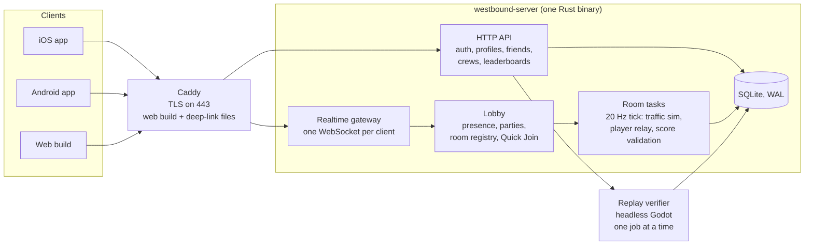
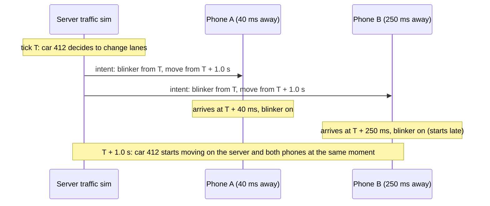

# Westbound Online — Multiplayer & Backend Handoff

Sep 29, 2026

This document extends `WESTBOUND_HANDOFF.md`. Everything in that document still applies unless this one overrides it. It covers the backend server, realtime multiplayer, the loop map, crew scoring, accounts, and moving every leaderboard onto our own server.

## Overview

Westbound Online recreates Assetto Corsa No Hesi–style crew cut-up driving on mobile. Up to 8 players share a room on a fixed highway loop, cut through server-run traffic together, and score as a crew. Everything is backed by one small Rust server, which also hosts cross-platform leaderboards for every mode.

The design follows No Hesi's own model: AssettoServer runs AI traffic on the server along predefined lanes on fixed maps, most famously the looped Shutoko expressway. Westbound adds one twist that fits its traffic design: every traffic action is telegraphed at least 1 second ahead. The server broadcasts those decisions the moment it makes them, so phones render traffic in the present instead of lagging behind.

**Pillars** (in priority order when they conflict):

1. **Everyone sees the same traffic at the same moment.** Close passes are measured in centimeters at 200+ km/h, so traffic sync is the core technical goal.
2. **Your own car never waits for the network.** Local driving feel is identical to single-player.
3. **Scores are trustworthy.** The server validates every multiplayer score and every leaderboard-worthy single-player score.
4. **Small footprint.** Designed for 1 vCPU and 2 GB of RAM, even though the production VPS has 4 vCPU and 8 GB.

**Decisions log**

| Topic | Decision | Notes |
| --- | --- | --- |
| Server | One Rust binary: tokio + axum | HTTP API + WebSocket gateway + room tasks in one process |
| Database | SQLite in WAL mode | One file on the VPS; nightly backups |
| TLS / front | Caddy reverse proxy | Automatic certificates; also serves the web build and deep-link files |
| Transport | Binary WebSocket (wss, port 443) on every platform | Behind a transport interface so native builds can move to UDP later |
| Traffic | Server-authoritative, with intents broadcast ahead of execution | Clients simulate traffic in the present and blend small corrections |
| Players | Client-authoritative for their own car | Server checks plausibility |
| Player contact | Ghosted (no collisions) | Server logs would-be contacts to inform a later "soft solid" decision |
| Room size | Up to 8 players | |
| Map | Fixed one-way loop, about 25 km | Built from existing biomes; about 7–8 minutes per lap |
| Time of day | Shared room clock with a day/night cycle | Night ×2 room-wide; Chase the Sun stays single-player |
| Rooms | Private (codes + invite links) and public (browser + Quick Join) | Parties let friends join public rooms together |
| Chat | No free text | Quick-chat phrases, horn and emotes only |
| Leaderboards | All on our server, cross-platform | Game Center / Play Games keep achievements only |
| Accounts | Silent device account + optional Sign in with Apple / Google | In-app account deletion |
| Hosting | Single VPS, single region | Production: 4 vCPU / 8 GB; design budget: 1 vCPU / 2 GB |

## Architecture



Each client keeps one WebSocket open while online, for everything: presence, invites, parties and room traffic. HTTP is used for authentication, profiles, friends, crews, leaderboards and run submissions. Each room is one tokio task that owns its state outright (no shared locks in the hot path). Rooms talk to connections only through bounded channels.

## Server tech stack

**Language and crates** (latest stable versions):

| Purpose | Crate |
| --- | --- |
| Async runtime | `tokio` (multi-thread runtime, 2 worker threads by default) |
| HTTP and WebSocket | `axum` (with `ws`), `tower-http` (tracing, CORS, compression) |
| Rate limiting | `tower_governor` |
| Database | `sqlx` with SQLite, built-in migrations, offline query metadata committed to the repo |
| JSON for HTTP | `serde`, `serde_json` |
| Tokens and provider sign-in | `jsonwebtoken`, `reqwest` (JWKS fetch, Apple token revocation) |
| Binary protocol | `bytes`; hand-written encoder/decoder (no code generator) |
| Logging and metrics | `tracing`, `tracing-subscriber`; a small Prometheus-text `/metrics` endpoint on localhost |
| CLI | `clap` (the same binary runs admin commands) |
| Errors | `anyhow`, `thiserror` |

**Cargo workspace layout**

```
westbound-server/
  Cargo.toml                  # workspace
  crates/
    protocol/                 # message types, binary codec, golden test vectors
    sim/                      # pure, deterministic: road-space math, loop map,
                              # IDM + MOBIL traffic, ramps, scoring rules, validation
    server/                   # binary: HTTP API, gateway, lobby, rooms, DB, admin CLI
    bots/                     # load-test and netcode-test bot clients
  migrations/                 # sqlx SQLite migrations
  data/                       # loop map road-space file, driver profiles (exported from Godot)
  deploy/                     # systemd unit, Caddyfile, backup script
```

**Rules for the server code**

1. **`sim` is pure.** No I/O, no clocks, no global state. It takes state and inputs and returns new state, so it can be unit-tested and fuzzed.
2. **One owner per room.** A room task owns its traffic, players and scores. Connections send it messages; it sends frames back.
3. **Bounded everything.**
    - Per-connection outbound queue of 64 frames; a client that falls behind is disconnected.
    - Maximum 16 KB per inbound message.
    - Per-connection rate limits on every message type.
4. **One frame per tick per client.** Each server tick bundles all updates for a client into a single WebSocket frame, to cut framing and TLS overhead.
5. **Data shared with the client comes from the client.** The loop's road-space data and the driver profiles are exported from the Godot project into `data/`. The server never has its own copy of a tuning value.

## Resource budget and deployment

**Design budget: 1 vCPU and 2 GB of RAM.** The production VPS (4 vCPU / 8 GB) gives a large margin.

| Resource | Target |
| --- | --- |
| Capacity on 1 vCPU | 20 full rooms (160 players) at no more than 50% of one core |
| Room tick time | p99 under 5 ms per 20 Hz tick |
| Server memory | Under 300 MB excluding the verifier |
| Verifier | One job at a time, `nice 10`, capped at 1 GB by systemd `MemoryMax` |
| Downstream per player | 10 KB/s or less, including framing |
| Upstream per player | About 1 KB/s |
| Hard caps (config) | 40 rooms, 400 connections |

**Bandwidth math.** At 10 KB/s, each player-hour costs about 36 MB of server outbound traffic, so 1,000 player-hours per month is about 36 GB. Check this against the VPS provider's monthly transfer allowance.

**Deployment:**

- **The binary:** one statically linked binary (musl target), run by systemd with automatic restart.
- **Caddy:** in front for TLS on 443. It proxies `/api/*` and `/ws` to the binary, serves the web build, and serves `apple-app-site-association` and `assetlinks.json` for deep links.
- **Database:** SQLite in WAL mode on local disk.
- **Backups:** a nightly `.backup` to a dated file with 7-day retention, plus an optional copy off the machine.
- **Logs:** go to journald.
- **Restarts:** the server broadcasts a notice 60 seconds before a planned restart. Clients reconnect automatically and rejoin the same private room by code, or Quick Join again.

## The loop map

A fixed, one-way highway loop of about 25 km, built once from the existing road generator with a fixed seed, hand-tuned in an editor tool, and frozen as map data. At cut-up speeds a lap takes about 7–8 minutes: long enough to feel like a journey, short enough to learn by heart.

**Sections** (in driving order; lengths are approximate):

| # | Section | Length | Character |
| --- | --- | --- | --- |
| 1 | Desert straight | 5 km | Start/finish gantry, 4 lanes, long sightlines, fast |
| 2 | Canyon | 5 km | Curves, crests, two tunnels (one narrows to 2 lanes) |
| 3 | Coast | 5 km | Cliffs, suspension bridge, the best sunset view on the map |
| 4 | City | 5 km | Elevated highway, 4 lanes, densest traffic, on-ramp and off-ramp |
| 5 | Farmland | 5 km | Long sweepers back to the desert, second ramp pair |

**Features:**

- **Lanes:** 3 by default, 4 in the desert and city, 2 in one canyon tunnel.
- **Ramps:** two on-ramp/off-ramp pairs where traffic enters and leaves, so traffic doesn't feel like a closed conveyor belt.
- **Road works:** a scheduled event the server can toggle on a section for a few laps. Not permanent.
- **Sectors:** 6 sector gantries around the loop do the single-player checkpoint's job (see Scoring).

**Map data** (`loop_v1`):

- **Client scene data:** the 3D centerline, biome zones, props and landmarks, streamed in chunks around the player as in single-player.
- **Road-space file** (JSON with a version and a content hash), shared by client and server:
    - total length `L`
    - lane count and lane width per `s` range
    - ramp positions and lengths, closure zones
    - sector gantry positions and the per-section lane flow speeds
    - spawn points
- **Wrapping:** `s` wraps modulo `L`. Every distance comparison uses the wrapped signed difference. Floating origin still applies on the client.
- **Hash check on join:** client and server compare map hashes when joining a room, and a mismatch is refused with a "please update" message.

**Editor tool** (Godot): generate the loop from a seed, adjust curve radii, crests, tunnel and bridge placement, and lane changes by hand, preview traffic in the sandbox, then export both the client scene data and the road-space file.

## Time of day in multiplayer

Chase the Sun stays a single-player mode. Multiplayer rooms share a clock instead:

- **Cycle:** 32 minutes long, with 22 minutes of day (morning → afternoon → golden hour → sunset) and 10 minutes of night.
- **Public rooms:** the clock is derived from UTC time, so every public room worldwide has night at the same moments. Night sessions become an event people can plan around.
- **Private rooms:** the host can pick the cycle, a fixed time of day, or permanent night.
- **Night ×2:** points earned at night count double for everyone in the room.
- **HUD:** the sun bar is replaced by a small clock showing time until night or dawn.

## Traffic: server-authoritative with intents

The server runs the traffic. Every discrete traffic decision is broadcast the moment it is made, at least 1 second before it takes effect. Each phone runs its own copy of traffic in the present and blends in small corrections. The fairness rule from single-player ("telegraph every move") becomes the netcode.

**Why:** at a 100 km/h speed difference, 100 ms of lag moves a car 2.8 m, which is bigger than the whole close-pass window. Showing streamed traffic slightly in the past would break the core mechanic.



### Server simulation (`sim` crate)

- **A port of the client model:** IDM for following, MOBIL for lane changes, driver profiles, lane discipline and keep-right bias. Parameters come from the exported driver profiles.
- **Fixed rate:** every car ticks at 20 Hz. There is no distance-based detail level; the whole ring is cheap in Rust.
- **Population:** the ring is kept at the room's density through the ramps. Normal density is 10 vehicles per km per lane, about 800 cars. Light is 6 and rush hour is 14.
- **Players are in the simulation:**
    - Each player is a vehicle at its latest reported state, extrapolated to the current tick.
    - Traffic follows players with IDM and checks MOBIL's safety criterion against them.
    - The no-ambush rule uses each player's predicted position.
    - Traffic's reaction to players therefore arrives with network delay, which reads as a driver's reaction time.
- **Multiplayer signal time:** at least 1.0 s for every profile, including aggressive drivers (0.6 s in single-player). The 1-second lead must cover the worst one-way latency with margin.
- **Hit reaction:** when a player's hit on a traffic car is accepted, the server applies the scripted hit reaction to that car (swerve, brake, hazards) and broadcasts it.

### What the server sends

| Message | When | Contents |
| --- | --- | --- |
| `TrafficSpawn` | A car enters the client's area of interest | Car id, vehicle type, color, profile, `s`, `d`, `v`, lane-change state |
| `TrafficDespawn` | A car leaves the area of interest or the ring | Car id |
| `TrafficIntent` | At decision time | Car id, kind (lane change, cancel, hazard, horn, hard brake), start tick, move-start tick, target lane, duration |
| `TrafficCorrection` | Continuously, in batches | Car id, tick, `s`, `d`, `v` |

**Area of interest:** each client receives the cars from 300 m behind to 900 m ahead of its own position on the loop (about 40 cars at normal density).

**Correction schedule:** cars within 100 m of the player are corrected 5 times a second; every other car in the area at least once a second (round-robin).

### Client network traffic (`network_traffic_source.gd`)

- **A new traffic source.** It plugs into the existing `SpawnSource` interface. In network mode the client director and client MOBIL are off; lane changes come only from server intents.
- **Longitudinal motion is local.** The client runs its local IDM, using the cars it knows about as leaders, so motion stays smooth between corrections.
- **Server time, not frame time.** All traffic is simulated at `server_now`, from the clock sync below.
- **Corrections:**
    - The client stores a short history of each car's state.
    - When a correction for tick N arrives, it compares against its own state at tick N and carries the error forward.
    - Errors under 0.5 m blend out over 0.3 s. Errors of 0.5–5 m blend out over 0.15 s. Anything larger snaps and is logged.
- **Late intents.** If an intent arrives after its start tick, the blinker starts late but the move still begins at the specified tick. If it arrives after the move-start tick (very rare), the car catches up along the move curve within 0.2 s.
- **Local-only extras.** The opposite carriageway and traffic reactions like horns and flashing headlights stay client-side and are not networked.
- **Dev HUD** adds network metrics: average and maximum correction size, late intents per minute, RTT and clock offset.

## Players

- **Your car is yours.** The client simulates its own car exactly as in single-player and sends a `PlayerState` 20 times a second:
    - tick, `s`, `d`, heading relative to the road
    - speed, lateral velocity, yaw rate, steer
    - flags: brake, boost, headlights, ghost, run state
- **Plausibility checks on the server:**
    - speed at or below the car's top speed × 1.1 (boost included)
    - acceleration and lateral movement within 1.2× the car's capability
    - no teleports (except server-approved respawns and rejoins)

  A violation marks the current run unverified (it never reaches a leaderboard) and is logged.
- **Other players:**
    - The server relays every room member's state to everyone (at most 7 others).
    - Clients show remote cars 100 ms behind with interpolation and extrapolate up to 250 ms, then fade the car until data arrives.
- **Ghosting:**
    - Players never collide with each other.
    - A remote car turns translucent when within 15 m of you and fully ghostly when overlapping.
    - Every remote car shows a nametag in its crew color.
- **Loop strip:** a thin bar along the top of the HUD shows the whole loop with a dot for every player and a mark for each sector gantry.
- **Spawning:**
    - The server picks a gap in traffic about 40 m behind your crew leader, or at the start gantry if you have no crew nearby.
    - You spawn at the section's flow speed with 3 seconds of protection: no traffic hits, and the minimum-speed rule paused.
- **Crash-out:** two hits end your run and a 3-second results toast shows the score. You then respawn next to your crew with a fresh run; you are never kicked back to a menu.
- **Rejoin crew:** a button teleports you to your crew at any time. It forfeits your unbanked chain and gives 3 seconds of protection.
- **Reconnect:**
    - If the connection drops (network switch, app backgrounded), your seat is held for 15 seconds.
    - On reconnect you respawn at your last position with your run intact if under 15 s. Otherwise the run ends with its banked score kept.
- **Shadow collision logging** (preparing for a later decision):
    - For every pair of players, the server records each moment their collision boxes would have overlapped, using both reported states at the same tick.
    - It also estimates how much the two players' views disagreed at that moment.
    - Aggregates (contacts per hour, speeds, disagreement distribution) go into the admin stats.

## Scoring in multiplayer

All single-player scoring rules carry over: pass, close pass, cut, thread, slipstream, multiplier decay by speed, minimum speed 100 km/h, hesitation, shoulder penalty, chain and banking, boost, two lives, the ghost after the first hit, and the second hit ending the run. The differences:

- **Sectors replace checkpoints.** Crossing a sector gantry banks your chain and pays sector bonuses (Clean, Pace, Threads, Heat). A clean sector restores a lost life.
- **No sun meter.** Hesitation no longer affects the sky; night ×2 comes from the room clock.

### Crew mechanics

- **Who is your crew.** In a private room, everyone in the room. In a public room, the party you joined with.
- **Proximity bonus.** For every crewmate within 30 m of you on the loop, each scoring event gets +0.25× (capped at ×2.0). This is No Hesi's crew multiplier, adapted.
- **Train bonus.**
    - Passing the same traffic car on the same side, or threading the same gap, within 1.0 s after a crewmate did it counts as a train.
    - Each train pays 25 base points and +2 multiplier.
    - Consecutive links count up (TRAIN ×2, TRAIN ×3…).
    - The server detects trains, because only it sees everyone's events.
- **Session crew total.** The combined banked score of the crew in this room session, shown in the room menu.

### Server-authoritative scoring

The client detects events locally for instant feedback, and the server keeps the official score.

1. **Claims.** For every event the client sends a claim: tick, type, traffic car id(s) and measured clearance.
2. **Verification.** The server checks each claim against its own traffic state and the player's reported state at that tick:
    - a pass needs the car to go from ahead to behind within ±300 ms of the claimed tick
    - a close pass needs server-measured clearance under 1.0 m + 0.35 m tolerance
    - a thread needs both sides to pass; a cut needs a traffic car within the cut window
3. **Official score.** The server runs the same scoring rules (`sim::scoring`) on accepted claims only, and adds crew bonuses and trains.
4. **Score sync.** The server sends `ScoreSync` (banked, chain, multiplier) at least once a second and at every banking moment. The client eases its display to the server's values at banking moments, so corrections never look like score being taken away mid-chain.
5. **Hits.**
    - The client reports its own hits and is authoritative for losing a life (it's your experience).
    - The server also detects contact from reported positions (overlap deeper than 0.3 m for 2 or more ticks).
    - A server-detected hit the client didn't report marks the run unverified. The run continues for fun but never reaches a leaderboard.

**Target:** honest clients get more than 99% of their claims accepted over realistic mobile networks, measured with the bot harness.

## Rooms, parties and matchmaking

**Rooms**

- **Settings:** id, 6-character code (no easily confused characters), private or public, up to 8 players, map `loop_v1`, traffic density, time-of-day mode.
- **Private rooms:**
    - The creator gets a code and an invite link `https://<domain>/r/<code>`.
    - The link opens the app through Universal Links (iOS) and App Links (Android), or the web build directly.
    - The creator is host: they can kick players and change density or time mode.
    - Host passes to the longest-present player when the host leaves.
    - The room closes 60 s after it empties.
- **Public rooms:**
    - Run by the server with normal density and the UTC clock, so they count for official leaderboards.
    - **Quick Join** picks the public room with the most players that still fits your whole party, and creates a new one if none fits.
    - The **room browser** lists public rooms with player count, density, day or night, and your ping.
- **Leaderboard eligibility:** only public-room runs count for the official Loop leaderboards. Private rooms with a custom density or clock count only toward personal stats. Private rooms left on the defaults also count.

**Parties**

- Up to 8 players, led by one player.
- The leader invites online friends, or shares a party code.
- The party moves between rooms together, and its members are each other's crew in public rooms.

**Friends and presence**

- **Friend codes** use the name#1234 form. Adding someone sends a request they accept.
- **Presence:** the friends list shows who is online, and a Join button appears when a friend is in a room with space.
- **Blocking:** a blocked player is never matched into your room through Quick Join and cannot invite you.
- **Push notifications** for invites while the app is closed are out of scope for v1.

**Quick chat** (no free text)

- A small wheel of preset phrases: "nice thread", "follow me", "slow down", "regroup", "gg", "one more lap".
- Plus a horn and a few emotes shown on the nametag.
- Rate-limited, and muted per player from the room menu.

**Crews (persistent)**

- **Membership:** a named crew with a 2–4 character tag, up to 16 members. You join by an invite code; an owner and officers can kick.
- **Separate from parties:** a party is temporary. The crew tag shows on nametags and leaderboards.

**Moderation**

- **Display names:** a profanity filter using a normalized word list (catches letter-for-number swaps) on names and crew names.
- **Report:** a player button (from the room menu or a leaderboard entry), rate-limited per account.
- **Admin CLI:** list reports, ban or unban (with duration), force-rename, and remove a run or leaderboard entry.

## Networking protocol

**Connection**

- One `wss://<domain>/ws` connection per client, authenticated by the access token in the first message.
- **Handshake:** `Hello {protocol_version, client_build, map_hash}` → `Welcome` or `Error`. Incompatible versions get a clear "please update" error.
- **Keepalive:** a ping every 2 s; the connection is considered dead after 8 s of silence.

**Encoding**

- Binary frames, little-endian. Each frame holds one or more messages, each as `[u8 type][u16 length][payload]`.
- **Quantization:**

| Field | Encoding | Range / precision |
| --- | --- | --- |
| Tick | u32 | 20 Hz server ticks since room start |
| `s` (position along loop) | u32 millimeters | Up to 4,294 km |
| `d` (lateral offset) | i16 centimeters | ±327 m, 1 cm |
| Speed | u16 cm/s | Up to 655 m/s |
| Heading vs road | i16 × 1e-4 rad | ±3.27 rad |
| Yaw rate, lateral velocity | i16 scaled | Documented per field |
| Car / player ids | u16 | Per room |

**Messages, client to server:** `Hello`, `Ping`, `LobbyCommand` (party, friends presence, room create/join/leave, Quick Join), `PlayerState`, `ScoreClaim`, `HitReport`, `RunEvent` (start, end, rejoin), `QuickChat`, `RoomHostCommand`.

**Messages, server to client:** `Welcome`, `Pong`, `Error`, `LobbyEvent`, `RoomSnapshot` (on join: members, crews, clock, settings), `PlayerStates` (batched, 20 Hz), `TrafficSpawn`, `TrafficDespawn`, `TrafficIntent`, `TrafficCorrection` (batched), `ScoreSync`, `ScoreEvent` (accepted crew bonuses and trains), `RunResult`, `RoomEvent` (join, leave, host change, kick, settings), `QuickChat`, `ServerNotice`.

**Clock sync**

- Ping/Pong carries the client send time and the server tick and time.
- The client keeps the 8 most recent samples, takes the offset from the sample with the lowest round trip, and slews its estimate smoothly (never jumps backward).
- `server_now()` returns a fractional server tick used by all network-mode simulation.

**Golden vectors.** The `protocol` crate writes test vectors (each message as JSON plus its exact bytes). The GDScript codec must encode and decode every vector identically. Both sides run these tests in CI.

**Client transport interface.**

- `NetTransport` has `connect`, `send`, `poll` and `close`, with a WebSocket implementation using Godot's `WebSocketPeer`.
- A UDP implementation for native builds is a possible later addition; nothing above the transport may assume TCP ordering except the lobby.

## Accounts and authentication

**Device account (silent, on first launch)**

- `POST /api/v1/auth/device` creates an account and returns an access token (JWT, 1 hour), a rotating refresh token (30 days) and a device secret.
- **Device secret storage:**
    - iOS: the Keychain, through a small native plugin, so it survives reinstalling.
    - Android: encrypted storage.
    - Web: local storage.
- The server stores only a hash of the secret.
- The game nudges players to link Apple or Google once they have progress worth keeping (after their first unlock).

**Sign in with Apple / Google (optional)**

- **Link:** `POST /api/v1/auth/link/apple` and `/link/google`. The server verifies the provider's ID token (signature via the provider's published keys, audience, expiry) and links the identity.
- **Sign in on a new device:** `POST /api/v1/auth/signin/apple` and `/signin/google` recover an account.
- **Conflict:** if the identity already belongs to another account, the client offers to switch to that account. Merging accounts is out of scope for v1.
- **Native side:** a small native plugin per platform (or a maintained community plugin if one fits). On web, v1 offers the device account only.
- **App Store rules:** offering Google sign-in on iOS requires also offering Sign in with Apple, which we do.

**Display names:** name#1234 form, 3–16 characters, profanity-filtered, renamable once every 30 days.

**Account deletion** (required by Apple for apps that create accounts):

- `DELETE /api/v1/account`, reachable from the profile screen.
- It deletes the account, friendships, crew memberships, runs and replays, and removes the player's leaderboard entries.
- For accounts linked to Apple, the server revokes the Apple token through Apple's revoke endpoint.

**Security**

- **Transport and secrets:** TLS everywhere; tokens are never logged.
- **Rate limits:** per IP and per account on every HTTP route; per connection on every WebSocket message type.
- **Input validation:** every inbound message is validated for size and ranges before it reaches a room.

## Leaderboards

All leaderboards live on our server and work across iOS, Android and web.

| Board | Ranks | Periods |
| --- | --- | --- |
| Loop | Best single run in a public room | Monthly season (like No Hesi's series) and all-time |
| Loop crew | Sum of the crew's top 4 members' season-best Loop runs | Monthly season |
| Journey | Best single-player Journey run | Weekly and all-time |
| Daily Drive | Best run on the day's seed | Per UTC date |
| Distance | Longest single-player run | All-time |

**Views:** global top 100, around me, and friends only.

**API:** `GET /api/v1/boards/{board}?period=&view=&limit=`.

**Multiplayer runs** go on the boards automatically. The server already holds the official score, so nothing is submitted by the client.

**Single-player runs** are submitted by the client when a run ends:

1. **Summary.** `POST /api/v1/runs` with a run summary: mode, seed, date, score, stats, car, client build, duration, distance.
2. **Plausibility checks on every submission:**
    - score per minute below a cap
    - distance consistent with duration and top speed
    - stats consistent with the score
    - the build is still supported
    - the Daily Drive seed matches the date
3. **Replay upload.** If the run would enter the top 100 of any board, or beat the player's personal best, the client also uploads a replay:
    - the player's path (`s`, `d`, speed, heading at 30 Hz)
    - inputs at 30 Hz
    - the client's event log

    About 100 KB compressed for a 10-minute run. The score shows as "verifying" until checked.
4. **Replay verification** (the verifier worker):
    - A headless Godot export of the same game build (Godot's dedicated-server export) loads the seed, regenerates road and traffic, and plays the recorded path back kinematically.
    - Because traffic reacts to the recorded path, tiny float differences between a phone and the server don't compound.
    - It recomputes every scoring event and hit, and checks the path against the car's physics limits.
    - **Accept** if the recomputed score is within 3% and no unreported hits are found; otherwise reject and log.
    - Jobs queue in SQLite and run one at a time with a timeout. Replays are deleted after verification except for current top-100 entries.
5. **Build parity.** Every client release also produces a matching Linux verifier build, keyed by build id. The server keeps verifiers for every build it still accepts.

**Determinism rules for the single-player simulation** (needed by the verifier; audit and fix the existing code):

- Simulation code uses the game's seeded RNG only; never engine random functions.
- No `pow`, `sin`, `cos`, `exp` or other library math in simulation paths. Road-space math uses arithmetic and `sqrt` only (for example, IDM's `(v/v0)^4` is written as repeated multiplication). Trig belongs only in rendering.
- Everything runs on the fixed physics tick, never frame time.
- No results depend on iteration order of unordered collections.

**Migration from Game Center / Play Games:**

- Their leaderboards are retired; achievements stay on the platform services.
- On first connection, the client uploads the player's local personal bests as "legacy" entries. They are shown with a marker and never used for rewards.

## Data model (SQLite)

| Table | Key columns |
| --- | --- |
| `accounts` | id, display_name, tag, device_secret_hash, apple_sub, google_sub, created_at, last_seen, banned_until, name_changed_at |
| `refresh_tokens` | token_hash, account_id, expires_at, rotated_from |
| `friends` | account_a, account_b, status (pending / accepted), created_at |
| `blocks` | account_id, blocked_id |
| `crews` | id, name, tag, owner_id, invite_code, created_at |
| `crew_members` | crew_id, account_id, role, joined_at |
| `runs` | id, account_id, mode, map_or_seed, date, score, stats (JSON), car, build, room_type, verification (pending / verified / rejected / unverified / legacy), created_at |
| `leaderboard_entries` | board, period_key, account_id, run_id, score (indexed by board + period + score) |
| `replays` | run_id, file_path, status, result, created_at |
| `reports` | reporter_id, target_id, reason, context, created_at, handled |
| `admin_log` | actor, action, target, detail, created_at |
| `shadow_contacts` | room_id, tick, player_a, player_b, speed, disagreement_m |

Rooms, parties and presence live only in memory. Replays are files under `data/replays/`; the table stores their paths.

## Client changes (Godot)

**New module `src/net/`**

- `transport.gd`, `ws_transport.gd`: the transport interface and its WebSocket implementation.
- `codec.gd`: binary encode/decode, mirroring the `protocol` crate.
- `clock.gd`: server clock sync and `server_now()`.
- `session.gd`: device account, token refresh, sign-in linking, secure storage plugins.
- `api.gd`: HTTP client for profiles, friends, crews, boards and runs (using `HTTPRequest`).
- `lobby.gd`: presence, parties, rooms, Quick Join, invites, deep-link handling.
- `room_client.gd`: joining, snapshots, respawn and rejoin, reconnect.
- `remote_player.gd`: interpolation, ghost rendering, nametags.
- `network_traffic_source.gd`, `traffic_corrector.gd`: server-driven traffic.
- `score_client.gd`: claims, hit reports, score sync, crew and train feedback.
- `replay_recorder.gd`: path and input recording for single-player runs.

**New and changed screens**

- **Online hub:** Quick Join, room browser, create a private room, join by code.
- **Party panel and friends list,** with online status and join buttons.
- **Profile and account:** link Apple / Google, rename, crew, delete account.
- **Crew page:** members, invite code, season standing.
- **Leaderboards:** tabs for Loop season, Loop crew, Journey, Daily Drive and Distance; views for global, around me and friends. Replaces the Game Center / Play Games boards.
- **In-room HUD additions:** the loop strip, crew proximity indicator (how many crewmates are in range), train counter, room clock, ping, quick-chat wheel.
- **Room menu:** invite, crew total, mute players, host settings, leave.
- **Settings:** nametag visibility, ghost opacity, quick-chat on/off.

**Loop map:** the editor tool, map export, and chunk streaming with wrap-around. The existing road builder, props and color script are reused.

**Performance:** remote players reuse player car materials with a shared translucent variant for ghosting, and nametags are drawn in one layer. Everything stays within the original performance budget.

## Testing

**Server (Rust, `cargo test`)**

- **Traffic parity:** the Rust IDM and MOBIL match the GDScript versions on shared test vectors to within 1e-9.
- **Scoring:** every event, anti-exploit rule, banking and loss case, plus crew proximity and train detection.
- **Codec and map:** every golden vector round-trips; wrap-around distance math is correct.
- **Traffic soak:** one simulated hour of the full loop at each density has zero traffic-to-traffic collisions and stable density, and every lane change is signaled for at least 1.0 s.
- **Fuzzing:** malformed and oversized inbound messages never crash a room.

**Netcode harness (`bots` crate)**

- **What the bots do:** drive scripted paths through traffic, send honest claims, and connect through an in-process delay layer with configurable latency, jitter and loss.
- **Acceptance** at 150 ms RTT, ±30 ms jitter and 2% loss:
    - claim acceptance above 99%
    - false server-detected hits under 1 per hour
    - median traffic correction under 0.15 m, 99th percentile under 0.6 m
    - late intents under 1 per 10 minutes

**Load test:** 20 rooms of 8 bots on a 1-vCPU limit (`taskset` or a cgroup). Must stay at or below 50% CPU, keep tick p99 under 5 ms, stay under 300 MB of memory, and send 10 KB/s or less per player.

**Client (headless Godot)**

- **Codec:** encodes and decodes every golden vector.
- **Clock sync:** converges within ±5 ms on a simulated link.
- **Traffic corrector:** a recorded server stream replayed through it keeps error within the thresholds above.
- **Replay recorder:** output matches the verifier's expected format.

**Verifier**

- 100% of honest replays accepted.
- Tampered replays rejected: inflated score, edited path (teleport, impossible lateral speed), removed hit, wrong seed.

**On-device, before every release:**

- a 30-minute crew session of at least 4 real phones over cellular
- one phone run through Apple's Network Link Conditioner at 150 ms / 2% loss

## Implementation milestones

Build in this order. Each milestone is done when its tests pass and its acceptance check is met. The single-player game keeps working at every step.

1. **N0 Server foundation.**
    - Deliverables: Cargo workspace; axum server with health route and WebSocket echo; SQLite and migrations; config; tracing; Caddy config; systemd unit; release build for the musl target.
    - Done when a phone connects over `wss://` through Caddy on the real VPS.
2. **N1 Accounts.**
    - Deliverables: device accounts, tokens and refresh; Apple / Google linking and sign-in; display names with filter; account deletion with Apple revocation; the secure-storage native plugins.
    - Done when an account survives an iOS reinstall and a linked account signs in on a second device.
3. **N2 Protocol and clock.**
    - Deliverables: `protocol` crate, golden vectors, GDScript codec, handshake, clock sync.
    - Done when golden vectors pass on both sides and clock sync meets its test.
4. **N3 Loop map.**
    - Deliverables: editor tool, `loop_v1` design and tuning, road-space export, client streaming with wrap-around, server map loading and hash check.
    - Done when the loop drives cleanly end-to-end in single-player test mode within the performance budget.
5. **N4 Networked traffic.**
    - Deliverables: Rust traffic port with parity tests, ramps and density, area of interest, intents, corrections; the network traffic source and corrector; network overlays in the traffic sandbox.
    - Done when two phones see the same traffic and the bot harness meets its correction targets.
6. **N5 Rooms and players.**
    - Deliverables: private rooms with codes, remote ghost players, spawning, crash-out respawn, rejoin crew, reconnect, loop strip, room clock with day/night.
    - Done when 4 friends can drive a full lap together.
7. **N6 Multiplayer scoring.**
    - Deliverables: claims, server validation, official score and sync, hit cross-check, sectors, crew proximity, trains, crew session total, night ×2.
    - Done when scoring tests pass and the bots' claim acceptance exceeds 99%.
8. **N7 Leaderboards.**
    - Deliverables: boards and seasons; multiplayer runs written automatically; single-player submissions with plausibility checks; legacy personal-best migration; leaderboard UI; Game Center / Play boards retired.
    - Done when every board shows correct global, around-me and friends views across iOS, Android and web.
9. **N8 Replay verification.**
    - Deliverables: replay recorder, determinism audit of single-player sim code, headless verifier build pipeline, verification queue, "verifying" state in the UI.
    - Done when the verifier tests pass and a verification job stays within its memory cap.
10. **N9 Social and public play.**
    - Deliverables: friends and presence, parties, persistent crews, public rooms, Quick Join, room browser, quick chat, report and block, deep-link invites.
    - Done when a party of 3 can Quick Join a public room together from an invite link.
11. **N10 Hardening.**
    - Deliverables: load test and tuning, shadow collision logging and admin stats, admin CLI, rate limits, backups, graceful restart, metrics.
    - Done when the load-test targets are met on a 1-vCPU limit and a planned restart reconnects everyone automatically.

## Future: soft-solid player collisions

Players are ghosted in v1. The shadow collision data decides whether contact is worth adding. If it is, the recommended version is "soft solid":

- **Local resolution.** Each client resolves contact against remote players' extrapolated positions: a push and a small speed change, never a hit.
- **No life cost.** Contact between players never costs a life or breaks a chain, so lag disagreements feel like rubbing, not unfair crashes.
- **No server arbitration.** The server keeps logging contacts for tuning.
- **Room option.** Rooms get a "ghost / soft solid" setting; public rooms default to ghost.
- **Already prepared:** `PlayerState` carries speed, lateral velocity and yaw rate from v1, so no protocol change is needed.

## Tuning reference (multiplayer)

Starting values in the server config and the client's `tuning.tres`. They are expected to change in playtesting; the tests pin the behaviors.

| Parameter | Starting value |
| --- | --- |
| Server tick | 20 Hz |
| Player state send rate | 20 Hz |
| Remote player interpolation delay / max extrapolation | 100 ms / 250 ms |
| Area of interest | 300 m behind, 900 m ahead |
| Correction rate | 5 Hz within 100 m, at least 1 Hz otherwise |
| Correction blending | Under 0.5 m over 0.3 s; 0.5–5 m over 0.15 s; over 5 m snap |
| Multiplayer signal time (all profiles) | 1.0 s minimum |
| Traffic density (light / normal / rush) | 6 / 10 / 14 vehicles per km per lane |
| Loop length / sectors | About 25 km / 6 |
| Day/night cycle | 32 min: 22 day, 10 night |
| Crew proximity | +0.25× per crewmate within 30 m, cap ×2.0 |
| Train | Within 1.0 s of a crewmate; 25 base, +2 multiplier |
| Claim tolerances | ±300 ms timing; +0.35 m clearance |
| Server hit detection | Overlap over 0.3 m for 2+ ticks |
| Spawn / rejoin protection | 3 s |
| Reconnect seat hold | 15 s |
| Private room close delay | 60 s after empty |
| Outbound queue per connection | 64 frames |
| Max inbound message size | 16 KB |
| Room / connection caps | 40 / 400 |
| Replay sample rate | 30 Hz |
| Replay acceptance | Recomputed score within 3%, no unreported hits |

## Open questions

- [ ] Domain name for the server and invite links (needed for TLS, Universal Links and App Links).
- [ ] VPS location and monthly transfer allowance (the budget above assumes 36 MB per player-hour).
- [ ] Push notifications for invites (APNs / FCM) after v1.
- [ ] Soft-solid collisions, decided from shadow contact data.
- [ ] Loop v2 with junctions and branches, Shutoko-style.
- [ ] Sign-in linking on the web build.

## Sources

- [AssettoServer](https://github.com/compujuckel/AssettoServer): the freeroam server behind No Hesi-style servers, with server-side AI traffic
- [AI lanes for AssettoServer traffic](https://assettohosting.com/en/article/traffic-simulation-ai-lanes-assetto-server): how server traffic follows predefined lanes, and the popular maps (Shutoko Revival Project and others)
- [Nakama Godot client](https://github.com/heroiclabs/nakama-godot): the batteries-included alternative considered and not chosen
- [WESTBOUND_HANDOFF.md](./WESTBOUND_HANDOFF.md): the original game design, scoring, traffic and performance rules this document builds on
