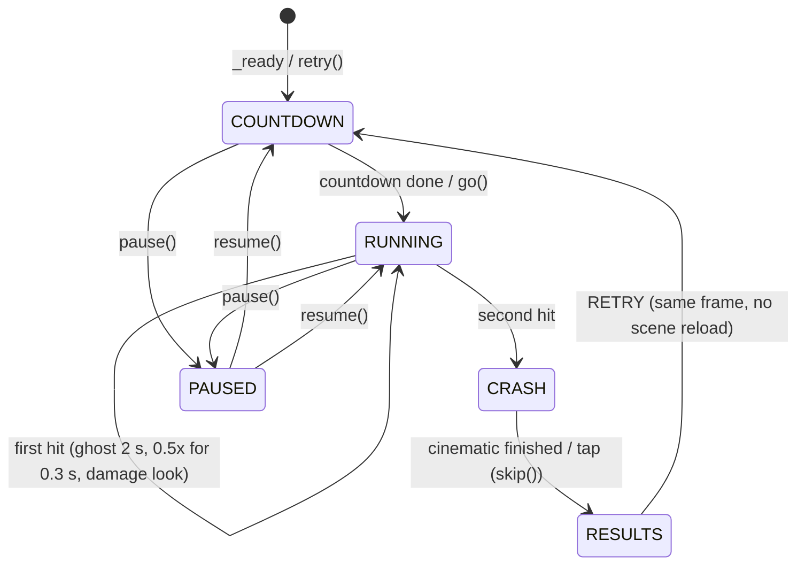

# Run loop

`src/run/run.tscn` / `run.gd` (`class_name Run`) is one run of the game: the world stack, the player car, traffic, the pure sims and their event buffer, the flow from countdown to results and retry. Built in WP4.1; the crash cinematic (WP4.2), HUD (WP4.3), screens (WP4.4), leg objectives (WP5.2), landmarks (WP5.3) and night lighting (WP5.4) plug into it as described below. Spec: "Core loop: Chase the Sun", "Scoring", "Lives, hits and crashes", "Run end". Contracts: [CONTRACTS.md](CONTRACTS.md) §4, §7, §8, §13, §14.

Related pages: [SCREENS.md](SCREENS.md) (countdown, pause, crash hint, results), [HUD.md](HUD.md) (gameplay HUD, `HudFeed`), [CRASH.md](CRASH.md) (the Jolt crash cinematic), [CORE_LOOP.md](CORE_LOOP.md) (sun clock, legs, lives, hit detection), [SCORING.md](SCORING.md), [NIGHT.md](NIGHT.md) (headlights, cones, lamp pools), [LANDMARKS.md](LANDMARKS.md) (checkpoint landmarks and warning signs).

| File | Class | Role |
| --- | --- | --- |
| `src/run/run.gd`, `run.tscn` | `Run` | flow, the 120 Hz tick, the frame update, retry, dev and snap hooks |
| `src/run/run_events.gd` | `RunEvents` | the §7 adapter: event buffers → `Events`, once per frame |
| `src/run/run_stats.gd` | `RunStats` | pure: the `run_over` stats from ticks and event records |
| `src/run/time_scale.gd` | `TimeScale` | slow motion (`Events.slowmo_requested`), reduced motion |
| `src/run/player_fx.gd`, `damage_fx.gdshader` | `PlayerFx` | ghost flicker, hood smoke, the flickering headlight (listener only) |
| `src/run/crash_sequence.gd` | `CrashSequence` | the second-hit cinematic ([CRASH.md](CRASH.md)) |
| `src/run/run_dev.gd` | `RunDevPanel` | the DEV rows (rule 10) |
| `src/run/run_loop.gd`, `room_clock.gd` | `RunLoop`, `RoomClock` | N3.2: the loop test mode and the room clock (see Loop mode below) |
| `src/ui/screens/run_screens.tscn` | `RunScreens` | in-run screens ([SCREENS.md](SCREENS.md)) |
| `src/ui/hud/hud.tscn` | `Hud` | the gameplay HUD ([HUD.md](HUD.md)) |
| `src/core/game.gd` | `Game` | states, `start_run`, `pause`/`resume`, per-mode HUD sections |

## Node map

```
Run (Node3D, run.gd; physics priority 50: after PlayerInput, before CameraRig)
├─ Sky              SkyRig (sky.tscn): pushes the wb_* globals each frame from sky_t
├─ PlayerInput      the input hub (physics priority -100: advances before the tick)
├─ CameraRig        chase / far / hood / overhead / cockpit (physics priority 100)
├─ Overlay/ControlsOverlay   the touch controls
├─ DevHud           the dev readouts (DevStats)
├─ TimeScale        slow motion
├─ RunEvents        the Events adapter
│   added in _ready(), in this order:
├─ FloatingOrigin   64-bit origin, update_focus() every tick
├─ BiomeDirector, RoadBuilder, Roadside, Landmarks     world nodes: setup(ctx, road, origin), update_view(s)
├─ BiomeFeatures    WP6.4c: WaterRibbon, ElevatedSections, FogCards (docs/BIOMES.md → Wiring)
├─ TrafficView      traffic rendering (its own headlight pools off: HeadlightCones draws them;
│                   biome_director set: each new car wears the palette of the biome it appears in)
├─ PlayerHeadlights, HeadlightCones, StreetLampPools   night lighting (visual only)
├─ PlayerFx         damage look
├─ RunScreens       countdown, pause, crash hint, results (intents in, flow calls out)
├─ Hud              installed when src/ui/hud/hud.tscn exists; bind(feed)
├─ RunDev           the DEV rows
├─ CrashSequence    when crash_cinematic (the default); advanced from frame()
└─ PlayerCar        placed by _start_run(); self_tick off (the run ticks it)
```

The pure sims live on the run as plain objects: `ProceduralRoadPath`, `TrafficSim`, `TrafficDirector`, `HitDetection`, `Lives`, `Scoring`, `SunClock`, `LegTracker`, `LegObjectives`, `RunStats`, one `ScoreEventBuffer` (`scoring.event_buffer_capacity × 5`) and one `HudFeed`.

## Flow



- **Countdown:** with `auto_countdown` (the default) the run counts `hud.countdown_from` steps of `hud.countdown_step_s` (a retry: `hud.retry_countdown_step_s`), emitting `Events.countdown_tick(n)` for 3, 2, 1 and 0 (GO). The countdown screen may hold it (`hold_countdown(true)`: web + gyro waits for the motion-permission tap). With `auto_countdown` off it waits for `go()`.
- **Rolling start:** the car waits at `s = road.roadside_behind_m` (the road starts at s = 0, so the chase camera never looks past it) in lane `legs.start_lane`, and leaves the line at `legs.start_speed_kmh` (120 km/h, above the minimum speed, so scoring is live at once). Leg 1 is that much shorter.
- **First hit:** `Events.hit`, the ghost (`ghost_started` / `ghost_ended`), `slowmo_requested(feel.slowmo_first_hit_scale, feel.slowmo_first_hit_s, &"first_hit")`, PlayerFx's damage look. The car keeps driving: `Lives.apply_hit_response` deflects it, takes `lives.first_hit_speed_loss_pct` and adds the wobble.
- **Second hit:** `scoring.notify_run_end`, every car within `lives.crash_brake_radius_m` (80 m) brakes (`TrafficSim.notify_hit`), then `CrashSequence.start(...)` hands the car (and a hit traffic car) to Jolt bodies ([CRASH.md](CRASH.md)); it emits `crash_started`, requests the crash slow motion and ends with `finished` → `_end_crash()`. Without the cinematic (`crash_cinematic = false`, tests and tools) the fallback brakes the car to a stop and ends after `feel.slowmo_crash_s` real seconds. A tap (`skip()`, also the crash screen's intent) jumps to the results.
- **Results:** `Events.run_over(results)` with `RunStats.results` plus `personal_best`, `new_best` and `previous_best`; `Save.submit_best_score(mode, score)` when `record_best`. The results screen opens on it.
- **Retry:** `retry()` (the results screen's RETRY, and QUIT until the title screen exists) builds a new `RunContext` and road, re-runs every world node's `setup()`, recreates `TrafficSim` / `TrafficDirector`, resets the sims, parks the crash bodies (`CrashSequence.reset()`) and keeps the car node, its model and the camera. The rebuild takes ~30 ms headless; with the 1.5 s retry countdown the player is driving again inside `hud.retry_max_s` (2 s, checked by `tests/integration/test_hits_loop.gd`).
- **Seeds:** run k uses `run_seed` for k = 0, then `Rng.derive_seed(run_seed, "retry/k")`. `run_seed = 0` draws `Rng.random_seed()` once at boot. Daily Drive keeps the day's seed for every attempt.
- **Pause:** `pause()` / `resume()` / `toggle_pause()` pause the tree (`Game.pause()`); the pause screen, `PlayerInput` and the screens always process. The HUD hides while PAUSED, CRASH and RESULTS.

## Per tick (120 Hz, fixed dt)

`tick()` (from `_physics_process`, or from a test with `manual_ticks`) always integrates `VehicleTuning.physics_dt()`: slow motion changes how many ticks run per real second, never their dt (`TimeScale`). Before the state machine, `_road_ahead()` keeps the road generated a view distance plus two chunks ahead, plans legs a whole leg past that, and trims road memory every 500 m, keeping `reach_behind_m()` behind the car: the larger of the roadside's reach and the biome features' (the coast's sea level averages the road over ±1.6 km, WP6.4c). RUNNING runs, in the CONTRACTS §4 order:

1. `car.tick(dt)`: the controller (`PlayerController` on the hub, or a test bot), `VehiclePhysics.step`
2. `traffic_sim.step` (the player as participant), `director.step`, `traffic_view.capture_tick()`. The director's behind spawns ask its own pure view test, `TrafficDirector.is_visible(s, d)` ("no visible pop-in"). It uses a fixed virtual view volume, anything ahead of the player's s minus `director.behind_spawn_view_margin_m` (25 m), and never the camera. So neither the camera mode, the screen aspect nor when the engine last drew a frame can change traffic (WP4.8, orchestrator decision; `test_behind_spawn_view_check_is_camera_independent`)
3. `lives.step`, `hit_detection.step` (or a `force_hit()` contact), `lives.on_contact`. A counted hit calls `scoring.notify_hit`, `legs.notify_hit` and `traffic_sim.notify_hit(slot)`; the run-ending one starts the crash and returns. Then `scoring.set_ghost(lives.is_ghost())`
4. `scoring.step`; the boost fill goes into `boost_meter` (clamped to 1); the new records are forwarded: `KIND_SUN_NUDGE` → `sun.lift`, `KIND_NEAR_MISS` → `traffic_sim.notify_close_pass` (the horn), thread / close pass → the leg tracker, thread / close pass / cut → the leg objective (a completion is paid at once)
5. `sun.advance(dt, scoring.is_too_slow())`, `scoring.set_night(sun.is_night())`, traffic headlights (on while the color script's `emissive_headlight` ramp at `sky_t` is above `sun.traffic_headlights_on_ramp`, sampled once into a 1024-entry table; `director.set_night` follows the same flag)
6. `LegObjectives.step` (brake, speed, slipstream, shoulder), `legs.observe_multiplier`, `legs.step`. A crossing runs the spec's order: `notify_checkpoint` (bank), `sun.on_checkpoint(avg speed)` (lift or dawn), the leg bonuses, a "no X" objective judged at the line, the journey bonus at the coast, `lives.restore_life` on a clean leg, then `set_night` again (a leg finished at night pays ×2) and the next leg's objective. The director's leg follows `legs.leg_index` (the DEV LEG button can pin it)
7. `RunStats.observe_tick` / `consume`; the safety net puts a car that left the carriageway (only possible through a barrier in the ghost) back in a lane

COUNTDOWN only counts; CRASH steps traffic (braking) and, without the cinematic, the skidding car. Every tick ends with `origin.update_focus()` on the car. The tick allocates nothing except when the road generator or the director plans ahead (director rate).

## Per frame

`frame(real_dt)` (from `_process` with the unscaled delta, or from a test) runs once per rendered frame:

1. the crash clock: `CrashSequence.advance(real_dt)` (or the fallback timer)
2. `RunEvents.drain()`: every buffered record becomes its `Events` signal, then the change-only values (`multiplier_changed`, `chain_changed`, `boost_started` / `boost_ended`, `boost_meter_changed`)
3. the frame-rate reactions queued by the tick: the first hit's slow-motion request; the fallback crash's `crash_started` and slow motion (the cinematic emits its own)
4. the views: `sky.sky_t = sun.sky_t`, `update_view(s)` on the biome director, road builder, roadside, landmarks, biome features, sky and traffic view, then the night lights (headlights follow `hub.high_beam`; they switch off in the crash)
5. `HudFeed` (speed, sun bar, checkpoint distance, objective progress, lives, chain, multiplier, ...) and the dev stats

Children process after the run, so the sky pushes its globals and the HUD reads the feed after this. The camera rig follows the car at physics priority 100.

## Where the subsystems hook in

| Subsystem | Hook | Doc |
| --- | --- | --- |
| Input hub | `$PlayerInput`; `camera_cycle_requested` → `rig.cycle_mode`, `pause_requested` → `toggle_pause`; the driving controller is `drive_controller` (default `PlayerController.new(hub)`) | [CONTROLS.md](CONTROLS.md) |
| HUD | `hud.bind(feed)`; `pause_pressed` → `toggle_pause`, `camera_pressed` → `hub.request_camera_cycle`; listens to `Events` | [HUD.md](HUD.md) |
| Screens | `screens.bind(hub, feed)`; intents `resume`, `recalibrate` (→ `hub.recalibrate_gyro`), `retry`, `quit` (→ `retry` for now), `skip`, `countdown_hold` | [SCREENS.md](SCREENS.md) |
| Crash cinematic | `_start_crash_sequence()`: `CrashSequence.start(car, contact, sim.state, traffic_view, road, origin, rig)`, `finished` → `_end_crash()`; `setup(ctx, registry)` per run, `reset()` on retry | [CRASH.md](CRASH.md) |
| Camera | listens to `Events.hit` (shake), boost and close passes; `rig.set_target(car, ...)` when the car node is (re)built | [CONTRACTS.md](CONTRACTS.md) §14 |
| Damage look | `PlayerFx` listens to `hit`, `ghost_started`, `ghost_ended`, `run_started`; numbers in `FeelTuning` "Damage look" | this page |
| Night lighting | `PlayerHeadlights`, `HeadlightCones` (bound to the traffic view and both traffic states), `StreetLampPools`: `setup(ctx, road, origin)` per run, `update_view(s)` per frame | [NIGHT.md](NIGHT.md) |
| Landmarks, signs, biomes | world nodes: `setup(ctx, road, origin)` per run, `update_view(s)` per frame | [LANDMARKS.md](LANDMARKS.md) |
| Biome features (WP6.4c) | `BiomeFeatures`: `bind(builder, sky)` once in `_ready` (the road mesher's ground drop, the horizon's sea mask), `setup` per run before `builder.build_all_now`, `update_view(s)` per frame; retries reuse the nodes | [BIOMES.md](BIOMES.md) |
| Leg objectives | `LegObjectives.start_leg` at each leg start, `step` / `notify_scored` per tick, `_pay_objective()` (bonus + `objective_completed`) | [CORE_LOOP.md](CORE_LOOP.md) |

The HUD, screens, camera, audio, haptics and particles only listen (rule 8). `tests/integration/test_fairness.gd` checks that the camera mode, removing the HUD, the control layout, the throttle mode and the high beams leave the run's trace hash unchanged.

## Tuning

Everything the run itself reads comes from `Run.tuning` (`Tuning.load_default()`): `legs.start_lane` / `legs.start_speed_kmh` (rolling start), `sun.traffic_headlights_on_ramp` (0.3), `lives.crash_brake_radius_m` (80 m), `hud.countdown_*` / `hud.retry_*`, `feel.slowmo_*`, `road.roadside_behind_m`. PlayerFx reads `FeelTuning`'s "Damage look" group: ghost flicker 12 Hz, the hood smoke (count at medium quality, lifetime, speed, direction, spread, rise, size, growth) and the dead lamp (14 Hz, 35% lit, fallback size, offset).

## Dev (rule 10)

DEV (top-left, under the score block): row 0 DEV ±, HUD (the dev HUD), CAM; row 1 STEER, THR, MIRROR; row 2 CAR, RECAL, RESET (car back into a lane), RETRY; row 3 RING/WHEEL, SIZE, LIVES (2 / INF); row 4 LEG (AUTO or a fixed director leg 1–8), SANDBOX, DRIVE (the M3 drive scene), LOOP (N3.2: the loop test mode on / off, a new run). `src/run/run_dev.gd` is the source of truth for the rows. Web: `?scene=drive` opens `src/dev/car_drive.tscn`, `?scene=sandbox` the traffic sandbox.

Run hooks for tools and tests: `set_dev_density_scale(x)` (the DENS knob; loop mode multiplies the loop's density), `dev_toggle_loop()`, `force_hit(source, slot, away_side)` (a contact at the next tick's collision step), `dev_teleport(s, v)` (car to `s`, traffic respawned, the leg keeps counting), `dev_reset_car()`, `set_leg_override(leg)`, `infinite_lives`, `trace_hash()` (car, traffic, scoring, lives, legs, objective, sun, stats), `manual_ticks` (tests call `tick()` and `frame()`).

**Snaps:** `tools/snap.sh src/run/run.tscn --state=countdown|running|paused|results --sky_t=… --s=… --speed_kmh=… --car=0..2 --cam=… --damaged --ghost --high_beam --seed=…` (default seed `Run.SNAP_SEED`), `--leg=N [--leg_s=M]` (M metres into leg N, default 600; negative: before its checkpoint), and since WP6.4c `--at=elevated` (the middle of the next elevated stretch), `--at=lane_ends [--at_m=150]` (before the next lane-ends sign) and `--hud=false` (no HUD, dev HUD, dev buttons or touch overlay: look reviews).

## Tests

- `tests/run/`: the flow, events on the bus, tick order, slow motion vs reduced motion, retry seeds, legs day → night → dawn (Gate M5), the crash sequence, the adapter, stats and time scale.
- `tests/integration/` (WP4.5): end-to-end scripted runs through the bus. `test_scoring_loop.gd` (every scoring event from a targeted scenario, the anti-exploit rules), `test_hits_loop.gd` (nothing scores in the ghost, the first hit leaves each car drivable above the minimum speed within 1 s, a ghost contact is ignored, second hit → cinematic → results → retry within `hud.retry_max_s`), `test_boost_loop.gd` (3 s of extra thrust, +8% top speed, slower multiplier decay), `test_fairness.gd`, `test_determinism.gd` (through a crash and retry; the soak tier runs 10 minutes twice). `run_harness.gd` is their shared harness: a quiet director and scripted traffic (`TrafficSim.spawn`), a scripted driver, the event log.

## Forks and the journey finale (WP6.5)

See [FORKS.md](FORKS.md). `RunForks` (`src/run/run_forks.gd`) gives the road its route plan and forks in `_start_run` (right after the road is made), the look plan to the biome director, and the first fork's zone to the builder and the director (`start()`, after the director exists). Per tick it runs first in `_sim_tick` (`forks.tick`: candidate path, the 1 km announcement, the choice at the split, the swap when the right branch is taken; `on_fork_swapped()` restarts the hit sweep) and after the director (`forks.guard_traffic()`); `forks.forget_before` follows the road's; `dev_teleport` calls `forks.sync(s)` first (forks jumped past take their left branch). `ForkView` draws both branches (`fork_view.update_view(s)` after the builder). `RunFinale` (`src/run/run_finale.gd`) is armed by the crossing that reaches the coast (`_dispatch_crossing`, after the journey bonus) and ticks after the traffic; it swings the camera, holds the car's lane (it swaps `car.controller` for the swing) and pushes `journey_complete`; the save is written in `frame()`. Adapter kinds: `RunForks.KIND_FORK_ANNOUNCED` (value = fork index; the adapter names both branches through `adapter.forks`), `KIND_FORK_TAKEN` (tag = biome), `RunFinale.KIND_JOURNEY_COMPLETE`. Snap options: `--at=fork|finale`, `--lane`, `--bot=keep`.


## Loop mode (N3.2)

See [LOOP_MAP.md](LOOP_MAP.md) → Wrap-around and the loop test mode. `mode = Run.MODE_LOOP` (`?mode=loop` on the web, `--mode=loop` natively, the dev LOOP button, `--mode=loop` in snaps) makes `_start_run` call `_setup_loop()` instead of building a `ProceduralRoadPath` and the forks:

- `RunLoop.run_tuning(tuning)` gives the run its own `Tuning` copy (the traffic tuning follows the section's flow speeds, the legs never reach the coast, the set-piece unlock order leaves out `LoopTuning.excluded_set_pieces`); the shared `Tuning.load_default()` is never written.
- `road` is the cached `LoopRoadPath` (`Run.road` is typed `RoadPath`; fork code casts to `ProceduralRoadPath`), the biome director gets the periodic plan, the elevated feature gets the loop's zone (`RunLoop.apply_features`, before the first build), and the car starts at `RunLoop.start_s()` (s = L + 150 m, lap 1). s is never wrapped on the client.
- The room clock starts from the wall clock (UTC), read once in `_setup_loop` unless `loop.clock_start_unix_s` is set (tests, snaps: `--clock_min`); the run prints `loop: loop_v1 map_hash=<hex>` the first time.
- Per tick, step 6 is `_loop_clock_tick`: `RunLoop.tick` advances the clock, pushes `night_started` / `morning_reached` on a flip, writes the section's flow speeds and density on a section change, and returns sky_t, which the run writes into `sun.sky_t` / `sun.phase` so the headlights, `scoring.set_night` and the trace read it as before. `sun.advance`, sun lifts (`KIND_SUN_NUDGE`), leg objectives, forks and the finale are skipped. `legs.step` runs the sector gantries; `_dispatch_crossing` in loop mode banks, pays the bonuses and restores a life on a clean sector, nothing else. The director keeps `LoopTuning.director_leg` (the dev LEG override still applies).
- Per frame, `RunLoop.fill_feed` fills `HudLoopFeed` (clock, flip countdown, sector distance, lap, sector), bound with `hud.bind_loop(feed)` at each run start (null in the journey).
- `trace_hash()` mixes the clock and section instead of the forks.
- Snaps: `tools/snap.sh src/run/run.tscn --mode=loop --at=<place> --clock_min=<m> --bot=keep` (places: `RunLoop.place_s`).
